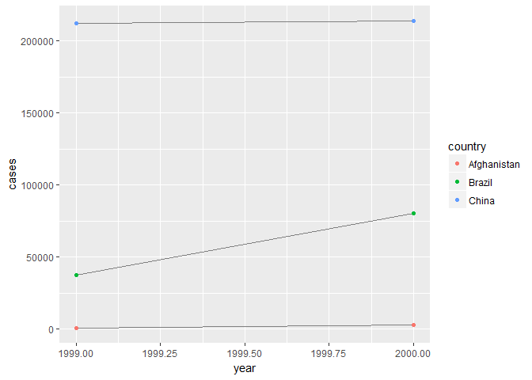

# Chapter 12 Tidy data


## 12.2 Tidy data

3 rules to make data tidy:  
1. Each variable must have own column  
2. Each observation must have own row  
3. Each value must have own cell  

Why make it tidy? There's an advantage to picking one consistent way of storing data. There's a specific advantage to placing variables in columns because it allows R's vectorised nature to shine. Most built-in R funcions work with vectors.  

### 12.2.1 Exercises  

**1. Using prose, describe how the variables and observations are organised in each of the sample tables.**  
_Variables are organised as columns and observations are organised as rows. In table one, the variables are the country, year, cases, and population. Each row is an observation, however each country has two observations: one for the year 1999 and one for the year 2000. In table two, instead of the cases and population bariables being separate, they are instead lumped together in a type variable and the count variable stores the observation for the cases and population variables. This means that for every country there are 4 rows. Table three has a completely unique variable rate which is the cases over population. Table 4a separates the year into 1999 and 2000 but only displays cases, and table 4b does the same but displays population._

**2. Compute the `rate` for `table2` and `table4a + table4b`. You will need to perform four operations:**  
**1. Extract the number of TB cases per country per year.**  
**2. Extract the matching population per country per year.**  
**3. Divide cases by population, and multiply by 10,000.**  
**4. Store back in the appropriate place.**  **Which representation is easiest to work with? Which is hardest? Why?**  

```r
table1 = tibble("country" = c("Afghanistan", "Afghanistan", "Brazil", "Brazil", "China", "China"), "year" = c(1999,2000,1999,2000,1999,2000), "cases" = c(745, 2666, 37737, 80488, 212258, 213766), "population" = c(19987371,20595360, 172006362, 174504898, 1272915272, 1280428583),"rate" = c(0.373, 1.294, 2.194, 4.612, 1.667, 1.669))
table1
```

```
## # A tibble: 6 × 5
##       country  year  cases population  rate
##         <chr> <dbl>  <dbl>      <dbl> <dbl>
## 1 Afghanistan  1999    745   19987371 0.373
## 2 Afghanistan  2000   2666   20595360 1.294
## 3      Brazil  1999  37737  172006362 2.194
## 4      Brazil  2000  80488  174504898 4.612
## 5       China  1999 212258 1272915272 1.667
## 6       China  2000 213766 1280428583 1.669
```

```r
table2 = tibble("country" = c("Afghanistan", "Afghanistan","Afghanistan", "Afghanistan","Brazil","Brazil","Brazil","Brazil","China","China", "China","China"), "year" = c(1999,1999,2000,2000,1999,1999,2000,2000,1999,1999,2000,2000), "type" = c("cases","population", "cases","population","cases","population","cases","population", "cases","population","cases","population"), "count" = c(745, 19987371, 2666, 20595360, 37737, 172006362, 80488, 174504898, 212258, 1272915272, 213766, 1280428583))
table2
```

```
## # A tibble: 12 × 4
##        country  year       type      count
##          <chr> <dbl>      <chr>      <dbl>
## 1  Afghanistan  1999      cases        745
## 2  Afghanistan  1999 population   19987371
## 3  Afghanistan  2000      cases       2666
## 4  Afghanistan  2000 population   20595360
## 5       Brazil  1999      cases      37737
## 6       Brazil  1999 population  172006362
## 7       Brazil  2000      cases      80488
## 8       Brazil  2000 population  174504898
## 9        China  1999      cases     212258
## 10       China  1999 population 1272915272
## 11       China  2000      cases     213766
## 12       China  2000 population 1280428583
```

```r
t1cases = table1["cases"]
t2cases = table2[table2$type=="cases","count"]
t1pop = table1["population"]
t2pop = table2[table2$type=="population","count"]

t1rate = t1cases/t1pop * 10000
t2rate = t2cases/t2pop * 10000
table1[["new.rate"]] = t1rate
info = tibble("country" = c("Afghanistan", "Afghanistan","Brazil","Brazil","China","China"), "year" = c(1999,2000,1999,2000,1999,2000), "type" = c("rate", "rate", "rate", "rate", "rate", "rate"))
info = cbind(info,t2rate)
table2 = rbind(table2, info)

table4a = tibble("county" = c("Afghanistan","Brazil","China"), "`1999`" = c(745, 37737, 212258), "`2000`" = c(2666, 80488, 213766))
table4a
```

```
## # A tibble: 3 × 3
##        county `\\`1999\\`` `\\`2000\\``
##         <chr>        <dbl>        <dbl>
## 1 Afghanistan          745         2666
## 2      Brazil        37737        80488
## 3       China       212258       213766
```

```r
table4b = tibble("county" = c("Afghanistan","Brazil","China"), "`1999`" = c(19987371,172006362,1272915272), "`2000`" = c(20595360,174504898,1280428583))
table4b
```

```
## # A tibble: 3 × 3
##        county `\\`1999\\`` `\\`2000\\``
##         <chr>        <dbl>        <dbl>
## 1 Afghanistan     19987371     20595360
## 2      Brazil    172006362    174504898
## 3       China   1272915272   1280428583
```

```r
rate1999 = table4a[["`1999`"]]/table4b[["`1999`"]] 
rate2000 = table4a[["`2000`"]]/table4b[["`2000`"]] 
table4c = tibble("county" = c("Afghanistan","Brazil","China"), "`1999`" = rate1999, "`2000`" = rate2000)
```


**3. Recreate the plot showing change in cases over time using `table2` instead of `table1`. What do you need to do first?**  

```r
ggplot(table1, aes(year, cases)) + 
  geom_line(aes(group = country), colour = "grey50") + 
  geom_point(aes(colour = country))
```

<!-- -->


## 12.3 Spreading and gathering

For most real analyses there will be need for tidying - one variable might be spread across multiple columns or one observation might be scattered across multiple rows. Two most important functions: `gather()` and `spread()`.  

### 12.3.1 Gathering  

A common problem is where some of the column names are not names oof variables but _values_ of a variable. In `table4a` the columns `1999` and `2000` are values of the `year` variable and each row represents two observations. We need to gather the columns into a new pair of variables. There are three parameters that need to be described:  
* The set of columns that represent values not variables. In this example, those are `1999` and `2000`.  
* The name of the variable whose values form the column names. This is the `key` and here it is `year`.  
* The name of he variable whose values are spread over the cells. This is called `value` and here it is the number of `cases`.  

The code would look like:  

```r
# table4a %>% gather(`1999`, `2000`, key="year". value="cases")
```

The columns to gather are specified with `dplyr::select()` style notation.What about for `table4b`?  

```r
# table4b %>% gather(`1999`, `2000`, key="year", value="population")
```

To combine the tidied versions into a single tibble, use `dplyr::left_join()`:  

```r
# tidy4a <- table4a %>% 
#  gather(`1999`, `2000`, key = "year", value = "cases")
#tidy4b <- table4b %>% 
#  gather(`1999`, `2000`, key = "year", value = "population")
#left_join(tidy4a, tidy4b)
```

### 12.3.2 Spreading  

Spreading is the opposite of gathering. In `table2` an observation is a country in a year but each observation is spread across two rows. There are two parameters needed:  
* The column that contains variable names is the `key` column. In `table2` it is `type`.  
* The column that contains values forms multiple variables is the `value` column. In `table2` it is `count`.  

Example:  

```r
# spread(table2, key=type, value=count)
```


`spread()` and `gather()` are complements. `gather()` makes wide tables narrower and longer; `spread()` makes long tables shorter and wider.  

### 12.3.3 Exercises  

**1. Why are `gather()` and `spread()` not perfectly symmetrical? Carefully consider the following example:**  

```r
stocks <- tibble(
  year = c(2015, 2015, 2016, 2016),
  half = c(   1,    2,     1,    2),
  return = c(1.88, 0.59, 0.92, 0.17)
)

stocks %>% 
  spread(year, return) %>% 
  gather("year", "return", `2015`:`2016`)
```

```
## # A tibble: 4 × 3
##    half  year return
##   <dbl> <chr>  <dbl>
## 1     1  2015   1.88
## 2     2  2015   0.59
## 3     1  2016   0.92
## 4     2  2016   0.17
```

**(Hint: look at the variable types and think about column names.)**  
**Both `spread()` and `gather()` have a `convert` argument. What does it do?**  
_`gather()` needs at least two columns to gather together and a designated column to to put these into. `spread()` on the other hand just needs a column to spread, and it pulls the new column names from the original column._

**2. Why does this code fail?**  

```r
#table4a %>% gather(1999, 2000, key="year", value="cases")
```

_The column names are specified incorrectly._

**3. Why does spreading this tibble fail? How could you add a nw column to fix the problem?**  

```r
people <- tribble(
   ~name,             ~key,    ~value,
  #-----------------|--------|------
  "Phillip Woods",   "age",       45,
  "Phillip Woods",   "height",   186,
  "Phillip Woods",   "age",       50,
  "Jessica Cordero", "age",       37,
  "Jessica Cordero", "height",   156
)
```

_Phillip Woods is on here twice with two different ages. A column can be added to specify between these two entries._

```r
people %>%
  mutate(entry = c(1,1,2,1,1)) %>%
  spread(key = key, value = value)
```

```
## # A tibble: 3 × 4
##              name entry   age height
## *           <chr> <dbl> <dbl>  <dbl>
## 1 Jessica Cordero     1    37    156
## 2   Phillip Woods     1    45    186
## 3   Phillip Woods     2    50     NA
```


**4. Tidy the simple tibble below. Do you need to spread or gather it? What are the variables?**  

```r
preg <- tribble(
  ~pregnant, ~male, ~female,
  "yes",     NA,    10,
  "no",      20,    12
)

#Gather
preg %>%
  gather(male, female, key = "gender", value = "count")
```

```
## # A tibble: 4 × 3
##   pregnant gender count
##      <chr>  <chr> <dbl>
## 1      yes   male    NA
## 2       no   male    20
## 3      yes female    10
## 4       no female    12
```


## 12.4 Separating and uniting  

`table3` has one column `rate` that contains two variables `cases` and `population`. TO tidy this table, use `separate()`. If there was a single variable spread across multiple columns use `unite()` to tidy it.  

### 12.4.1 Separate  

`separate()` pulls apart one column into multiple columns by splitting wherever a separator character appears. For `table3`, the `rate` column contains both `cases` and `population` variables. `separate()` takes the name of the column to separate, and the names of the columns to separate into:  

```r
# table3 %>% separate(rate, into=c("cases", "population"))
```

By default, `separate()` will split values wherever it sees a non-alphanumeric character. You can specify the character if you want with `sep = "/"`. The default behavior of `separate()` leaves the type of the column as is. So `case` and `population` are left as character columns. We can change this with `convert = TRUE`. We can also give `sep` a vector of integers. The function will interpret them as positions to split at. Positive values start at 1 on the far-left of the strings; negative values start at -1 on the far-right. When using integers to separate strings, the length of `sep` should be one less than the number of names in `into`.  

### 12.4.2 Unite  

`unite()` is the inverse of `separate()` and is used less often. It combines multiple columns into a single column:  

```r
table5 %>% 
  unite(new, century, year)
```

```
## # A tibble: 6 × 3
##       country   new              rate
## *       <chr> <chr>             <chr>
## 1 Afghanistan 19_99      745/19987071
## 2 Afghanistan 20_00     2666/20595360
## 3      Brazil 19_99   37737/172006362
## 4      Brazil 20_00   80488/174504898
## 5       China 19_99 212258/1272915272
## 6       China 20_00 213766/1280428583
```

Here we also need to use the `sep` argument. The default places an underscore between the values from different columns.  

```r
table5 %>% 
  unite(new, century, year, sep = "")
```

```
## # A tibble: 6 × 3
##       country   new              rate
## *       <chr> <chr>             <chr>
## 1 Afghanistan  1999      745/19987071
## 2 Afghanistan  2000     2666/20595360
## 3      Brazil  1999   37737/172006362
## 4      Brazil  2000   80488/174504898
## 5       China  1999 212258/1272915272
## 6       China  2000 213766/1280428583
```

### 12.4.3 Exercises  

**1. What do the `extra` and `fill` arguments do in `separate()`? Experiment with the various options for the following two toy datasets.**  

```r
tibble(x = c("a,b,c", "d,e,f,g", "h,i,j")) %>% 
  separate(x, c("one", "two", "three"))
```

```
## Warning: Too many values at 1 locations: 2
```

```
## # A tibble: 3 × 3
##     one   two three
## * <chr> <chr> <chr>
## 1     a     b     c
## 2     d     e     f
## 3     h     i     j
```

```r
tibble(x = c("a,b,c", "d,e,f,g", "h,i,j")) %>% 
  separate(x, c("one", "two", "three"), extra = "drop")
```

```
## # A tibble: 3 × 3
##     one   two three
## * <chr> <chr> <chr>
## 1     a     b     c
## 2     d     e     f
## 3     h     i     j
```

```r
tibble(x = c("a,b,c", "d,e,f,g", "h,i,j")) %>% 
  separate(x, c("one", "two", "three"), extra = "merge")
```

```
## # A tibble: 3 × 3
##     one   two three
## * <chr> <chr> <chr>
## 1     a     b     c
## 2     d     e   f,g
## 3     h     i     j
```

```r
tibble(x = c("a,b,c", "d,e", "f,g,i")) %>% 
  separate(x, c("one", "two", "three"))
```

```
## Warning: Too few values at 1 locations: 2
```

```
## # A tibble: 3 × 3
##     one   two three
## * <chr> <chr> <chr>
## 1     a     b     c
## 2     d     e  <NA>
## 3     f     g     i
```

```r
tibble(x = c("a,b,c", "d,e", "f,g,i")) %>% 
  separate(x, c("one", "two", "three"), fill = "left")
```

```
## # A tibble: 3 × 3
##     one   two three
## * <chr> <chr> <chr>
## 1     a     b     c
## 2  <NA>     d     e
## 3     f     g     i
```

```r
tibble(x = c("a,b,c", "d,e", "f,g,i")) %>% 
  separate(x, c("one", "two", "three"), fill = "right")
```

```
## # A tibble: 3 × 3
##     one   two three
## * <chr> <chr> <chr>
## 1     a     b     c
## 2     d     e  <NA>
## 3     f     g     i
```

**2. Both `unite()` and `separate()` have a `remove` argument. What does it do? Why would you set it to `FALSE`?**  
_The `remove` argument removes the new table from the original. When set to `FALSE`, the output is a combination of the transformed and original tables._

**3. Compare and contrast `separate()` and `extract()`. Why are there three variations of separation (by position, by separator, and with groups), but only one unite?**  
_When separating data, there are multiple ways to separate it based on the table construction. Thus the need for multiple variations. For extracting data, you really only want the data in a given column or row._
