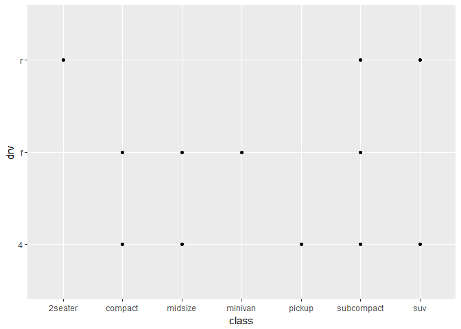

# R for Data Science, Chapter 3

# Data Visualization 

We will be using the _tidyverse_ dataset:


### 3.2.4 Exercises 
**1. Run ggplot(data = mpg) what do you see?**  

```r
ggplot(data = mpg)
```

<!-- -->
_Well, nothing happens. I don't get a plot. But according to the text under 3.2.2, that's what's supposed to happen._  

**2. How many rows are in mtcars? How many columns?**   
_To look at the number of rows and columns in mtcars, I can run the code below._  

```r
nrow(mtcars)
```

```
## [1] 32
```

```r
ncol(mtcars)
```

```
## [1] 11
```
_There are 32 rows and 11 columns._  

**3. What does the drv variable describe? Read the help for ?mpg to find out.**  
_The drv variable describes the kind of drive the car has, as in front-wheel drive (f), rear wheel drive (r), or 4 wheel drive (4wd)._  

**4. Make a scatterplot of hwy vs cyl.**  

```r
ggplot(data = mpg) + 
  geom_point(mapping = aes(x = hwy, y = cyl))
```

<!-- -->

**5. What happens if you make a scatterplot of class vs drv. Why is the plot not useful?**  

```r
ggplot(data = mpg) + 
  geom_point(mapping = aes(x = class, y = drv))
```

<!-- -->

_This plot isn't useful because these are qualitative variables. It doesn't provide a count of how many compacts there are with front wheel drive versus 4 wheel drive; it just provides the information that compacts have fall into both of those categories._  

### 3.3.1 Exercises 
**1. What's wrong with this code? Why are the points not blue?**  

```r
ggplot(data = mpg) + 
  geom_point(mapping = aes(x = displ, y = hwy, color = "blue"))
```

<!-- -->
_The color option doesn't actually take a color argument. It takes another set of date, like class, and colors the points on the graph according to the different classes the points fall into. Since there are 7 classes, there would be 7 different colors on the graph. To properly get the blue color, one sets color = "blue" outside of aes()._  

**2. Which variables in mpg are categorical? Which variables are continuous? Hint: type ?mpg to read the documentation for the dataset. How can you see this information when you run mpg?**  
_Manufacturer, model, trans, fl, and class are all categorical. When you run mpg, the columns (variables) are classified as <int> or <dbl> for numbers and <chr> for character, or letters/words._  

**3. Map a continous variable to color, size, and shape. How do these aesthetics behave differently for categorical vs continous variables?**  
_First, r throws an error that a continous variable cannot be mapped to shape. So let's try it without giving a shape._  

```r
ggplot(data = mpg) + 
  geom_point(mapping = aes(x = displ, y = hwy, color = year, size = cty))
```

<!-- -->
_If a continous variable is given for color, it appears that the color is then based on a gradient instead of each year being it's own distinct color. As for size, a continous variable seems to have the same effect. Luckily, cty had consistent increments so the size distribution looks constant._  

**4. WHat happens if you map the same variable to multiple aesthetics?**  

```r
ggplot(data = mpg) + 
  geom_point(mapping = aes(x = cty, y = cty, color = cty, size = cty))
```

<!-- -->
_As an extreme test, I made each option in aesthetics the same variable cty. The resulting plot is a straight line with a continous range of colors and sizes for the data points._  

**5. What does the stroke aesthetic do? What shapes does it work with? Hint: use ?geom_point.**  
_The stroke aesthetic modifies the width of the border of outlined data points._  

**6. What happens if you map an aesthetic to something other than a variable name, like aes(color = displ < 5)?**  

```r
ggplot(data = mpg) + 
  geom_point(mapping = aes(x = displ, y = hwy, color = displ < 5))
```

<!-- -->
_It appears that this sets a rule for the color. If the displ is less than 5, the data point is colored one way and another way if it is not less than 5. However, this particular example only appears to be binary._  

### 3.5.1 Exercises  
**1. What happens if you facet on a continuous variable?**  
**2. What do the empty cells in plot with facet_grid(drv ~ cyl) mean? How do they relate to this plot?**  

```r
ggplot(data = mpg) + 
  geom_point(mapping = aes(x = drv, y = cyl))
```

<!-- -->

**3. What plots does the following code make? What does . do?**  

```r
ggplot(data = mpg) + 
  geom_point(mapping = aes(x = displ, y = hwy)) + 
  facet_grid(drv ~ .)
```

<!-- -->

**4. Take the first faceted plot in this section:**

```r
ggplot(data = mpg) + 
  geom_point(mapping = aes(x = displ, y = hwy)) + 
  facet_wrap(~ class, nrow = 2)
```

<!-- -->
**What are the advantages to using faceting instead of the colour aesthetic? What are the disadvantages? How might the balance change if you had a larger dataset?**  
**5. Read ?facet_wrap. What does nrow do? What does ncol do? WHat other options control the layout of the individual panels? Why doesn't facet_grid() have nrow and ncol variables?**  
**6. When using facet_grid() you should usually put the variable with more unique levels in the columns. Why?**  
