# Data Visualization Continued

### 3.6.1 Exercises
**1. What `geom` would you use to draw a line chart? A boxplot? A histogram? An area chart?**  
_For a linechart use_ `geom_smooth` `geom_(ab/v/h)line` `geom_segment` `geom_spoke`. _For a boxplot, use_ `geom_boxplot`. _For a histogram, use_ `geom_histogram`. _For an area chart, use_ `geom_area`.

**2. Run this code in your head and predict what the output will look like. Then run the code in R and check your predictions.**  
_I predict that the x-axis will be displacement, y-axis will be mpg on highway, and the color of the points will be designated based on drive type. The se=FALSE I think gets rid of shaded area around the line._


```r
ggplot(data = mpg, mapping = aes(x = displ, y = hwy, color = drv)) + 
  geom_point() + 
  geom_smooth(se = FALSE)
```

```
## `geom_smooth()` using method = 'loess'
```

<!-- -->

**3. What does `show.legend = FALSE` do? What happens if you remove it?**  
_It hides the legend. The default is  TRUE._

**4. What does the `se` argument to `geom_smooth()` do?**  
_It adds the standard area (the shaded part) to the graph._

**5. Will these two graphs look different? Why/why not?**  
_No. The first set of code is just shorter and cleaner._

```r
ggplot(data = mpg, mapping = aes(x = displ, y = hwy)) + 
  geom_point() + 
  geom_smooth()
```

```
## `geom_smooth()` using method = 'loess'
```

<!-- -->

```r
ggplot() + 
  geom_point(data = mpg, mapping = aes(x = displ, y = hwy)) + 
  geom_smooth(data = mpg, mapping = aes(x = displ, y = hwy))
```

```
## `geom_smooth()` using method = 'loess'
```

<!-- -->

**6. Recreate the R code necessary to generate the following graphs.**  

```r
ggplot(data = mpg, mapping = aes(x = displ, y = hwy)) +
  geom_point() + 
  geom_smooth(se = FALSE)
```

```
## `geom_smooth()` using method = 'loess'
```

<!-- -->


```r
ggplot(data = mpg, mapping = aes(x = displ, y = hwy)) +
  geom_point() + 
  geom_smooth(mapping = aes(group = drv), se = FALSE)
```

```
## `geom_smooth()` using method = 'loess'
```

<!-- -->


```r
ggplot(data = mpg, mapping = aes(x = displ, y = hwy, color = drv)) + 
  geom_point() + 
  geom_smooth( se = FALSE)
```

```
## `geom_smooth()` using method = 'loess'
```

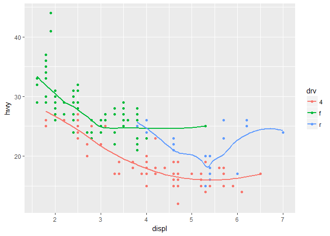<!-- -->


```r
ggplot(data = mpg, mapping = aes(x = displ, y = hwy)) +
  geom_point(mapping = aes(color = drv)) + 
  geom_smooth( se = FALSE)
```

```
## `geom_smooth()` using method = 'loess'
```

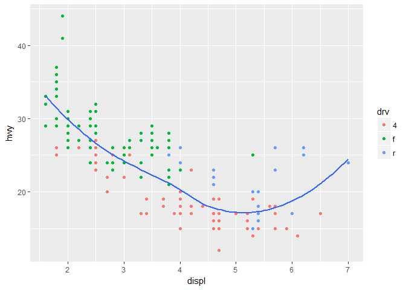<!-- -->


```r
ggplot(data = mpg, mapping = aes(x = displ, y = hwy)) +
  geom_point(mapping = aes(color = drv)) + 
  geom_smooth( se = FALSE, mapping = aes(linetype = drv))
```

```
## `geom_smooth()` using method = 'loess'
```

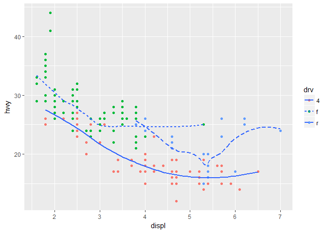<!-- -->


```r
ggplot(data = mpg, mapping = aes(x = displ, y = hwy, color = drv)) + 
  geom_point(mapping = aes( fill = drv), size =3, shape = 21, stroke = 3, color= "white")
```

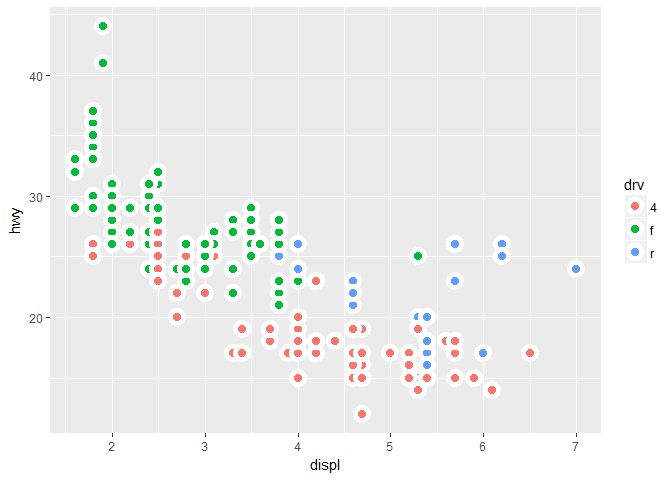<!-- -->


### 3.7.1 Exercises  
**1. What is the default geom associated with `stat_summary()`? How could you rewrite the previous plot to use that geom function instead of the stat function?**  
`stat_summary` _is associated with_ `geom_histogram` _or_ `geom_freqpoly`.

**2. What does `geom_col()` do? How is it different to `geom_bar()`?**  
`geom_col()` _maps mean on y-axis. The height of the bars represent values in the data so there is no transformation._ `geom_bar()` _maps counts on the y-axis which means it transformed the data._

**3. Most geoms and stats come in pairs that are almost always used in concert. Read through the documentation and make a list of all the pairs. What do they have in common?**  
?geom_curve # stat = identity 
?geom_path # identity 
?geom_polygon # same 
?geom_rect # same 
?geom_ribbon # same

?geom_segment # identity 
?geom_spoke # identity 
?geom_hline #doesn't use a stat; values specified directly

?geom_area # identity 
?geom_density # density 
?geom_dotplot # identity 
?geom_freqpoly # bin (histogram/frequency) ?geom_histogram # bin 
?geom_qq #qnorm seems default distribution (quantile-quantile plot)

?geom_count # stat is sum 
?geom_hex # stat is binhex

**4. What variables does `stat_smooth()` compute? What parameters control its behaviour?** 
_It computes the formula the programmer specifies giving lots of flexibility. Parameters include confidence interval, amount of smoothing, and smoothing method._

**5. In our proportion bar chart, we need to set `group = 1`. Why? In other words what is the problem with these two graphs?**  

```r
#This graph sets each category sum=1 so it's uninformative.
ggplot(data = diamonds) + 
  geom_bar(mapping = aes(x = cut, y = ..prop..))
```

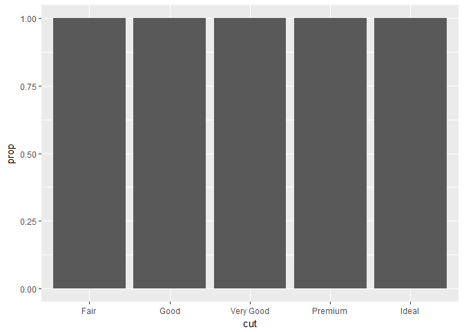<!-- -->


```r
#Same thing, but the groups are separated by color now which still not helpful.
ggplot(data = diamonds) + 
  geom_bar(mapping = aes(x = cut, fill = color, y = ..prop..))
```

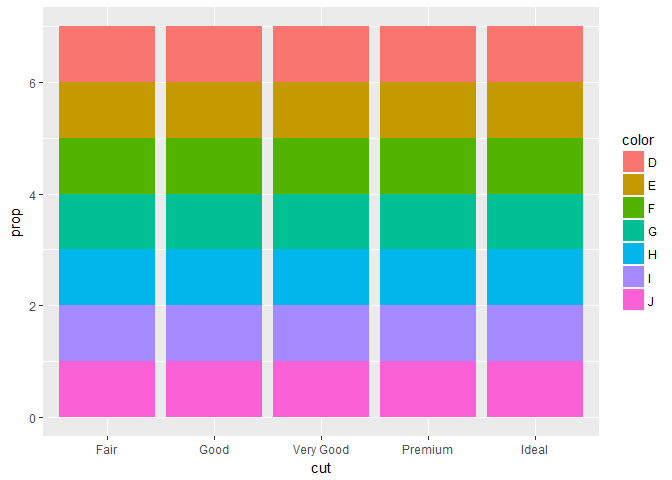<!-- -->


```r
#This is better.
ggplot(data = diamonds) + 
  geom_bar(mapping = aes(x = cut, fill = color, y = ..prop.., group = 1))
```

<!-- -->


```r
#Or this.
ggplot(data = diamonds) + 
  geom_bar(mapping = aes(x = cut, fill = color))
```

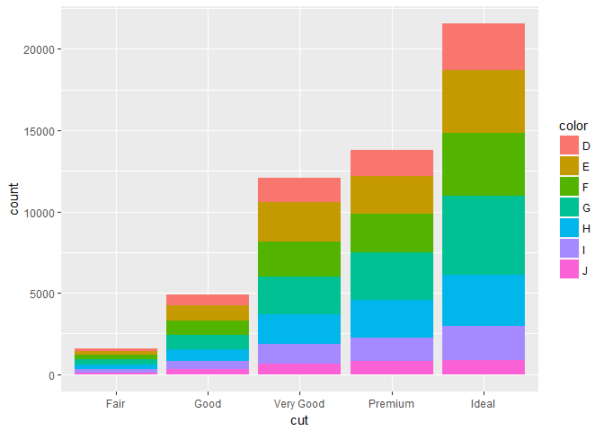<!-- -->


### 3.8.1 Exercises  
**1. What is the problem with this plot? How could you improve it?**  

```r
ggplot(data = mpg, mapping = aes(x = cty, y = hwy)) + geom_point()
```

<!-- -->

_This is overplotted. Jitter will help._

```r
ggplot(data = mpg, mapping = aes(x = cty, y = hwy)) + 
  geom_jitter()
```

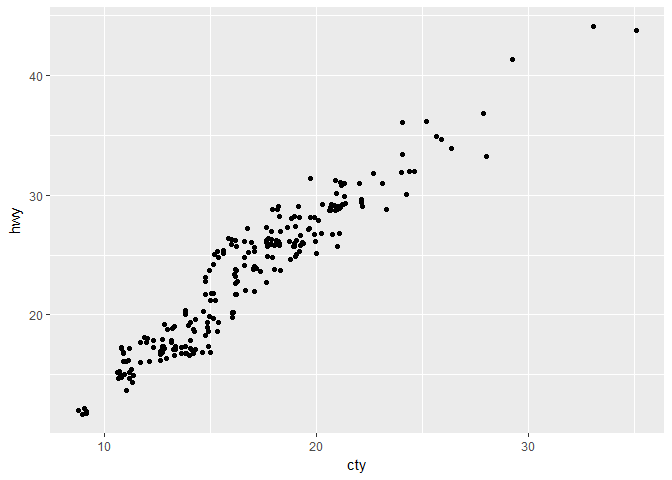<!-- -->


**2. What parameters to `geom_jitter()` control the amount of jittering?**  
_It takes position, width, and height._

**3. Compare and contrast `geom_jitter()` with `geom_count()`.**  
`geom_count()` _is best used with_ `scale_size_area()` _which ensures that counts of zero are given a size of 0. By default, all categorical variables form groups but specifying without a group identifier makes a plot that is not useful (all the points are the same size)._

**4. What’s the default position adjustment for `geom_boxplot()`? Create a visualisation of the `mpg` dataset that demonstrates it.**  
_Position = identity._

```r
ggplot(data = mpg, mapping = aes(x = class, y = displ)) +
  geom_boxplot(position = "identity")
```

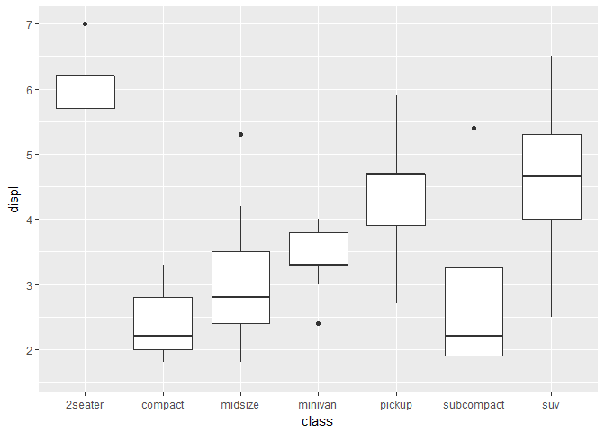<!-- -->


### 3.9.1 Exercises
**1. Turn a stacked bar chart into a pie chart using `coord_polar()`.**  

```r
myplot <- ggplot(data = diamonds) + 
  geom_bar(mapping = aes(x = cut, fill = clarity))

myplot + coord_polar()
```

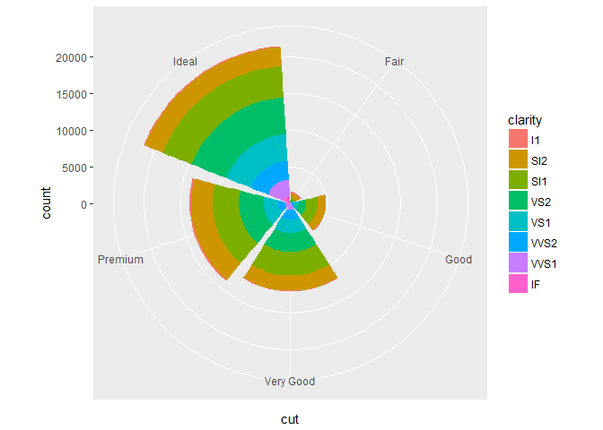<!-- -->


**2. What does `labs()` do? Read the documentation.**  
_This modifies the axes, legend, and plot labels._

**3. What’s the difference between `coord_quickmap()` and `coord_map()`?**  
`coord_map()` _is better and more precise than_ `coord_quickmap()` _but_ `coord_quickmap()` _is best at the equator and is faster._

**4. What does the plot below tell you about the relationship between city and highway mpg? Why is `coord_fixed()` important? What does `geom_abline()` do?**
`coord_fixed()` _makes the plot square._ `geom_abline()` _adds a diagonal line._


```r
ggplot(data = mpg, mapping = aes(x = cty, y = hwy)) +
  geom_point() + 
  geom_abline() +
  coord_fixed()
```

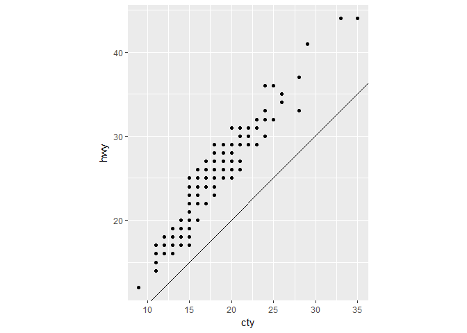<!-- -->

### 4.4 Practice
**1. Why does this code not work?**  

```r
my_variable <- 10
my_varıable
```

```
## [1] 10
```

```r
#> Error in eval(expr, envir, enclos): object 'my_varıable' not found
```

_1 is not the same as i, and that is the typo when trying to call_ `my_variable`.

**2. Tweak each of the following R commands so that they run correctly:**  

```r
library(tidyverse)

ggplot(data = mpg) + 
  geom_point(mapping = aes(x = displ, y = hwy))
```

<!-- -->

```r
filter(mpg, cyl == 8)
```

```
## # A tibble: 70 × 11
##    manufacturer              model displ  year   cyl      trans   drv
##           <chr>              <chr> <dbl> <int> <int>      <chr> <chr>
## 1          audi         a6 quattro   4.2  2008     8   auto(s6)     4
## 2     chevrolet c1500 suburban 2wd   5.3  2008     8   auto(l4)     r
## 3     chevrolet c1500 suburban 2wd   5.3  2008     8   auto(l4)     r
## 4     chevrolet c1500 suburban 2wd   5.3  2008     8   auto(l4)     r
## 5     chevrolet c1500 suburban 2wd   5.7  1999     8   auto(l4)     r
## 6     chevrolet c1500 suburban 2wd   6.0  2008     8   auto(l4)     r
## 7     chevrolet           corvette   5.7  1999     8 manual(m6)     r
## 8     chevrolet           corvette   5.7  1999     8   auto(l4)     r
## 9     chevrolet           corvette   6.2  2008     8 manual(m6)     r
## 10    chevrolet           corvette   6.2  2008     8   auto(s6)     r
## # ... with 60 more rows, and 4 more variables: cty <int>, hwy <int>,
## #   fl <chr>, class <chr>
```

```r
filter(diamonds, carat > 3)
```

```
## # A tibble: 32 × 10
##    carat     cut color clarity depth table price     x     y     z
##    <dbl>   <ord> <ord>   <ord> <dbl> <dbl> <int> <dbl> <dbl> <dbl>
## 1   3.01 Premium     I      I1  62.7    58  8040  9.10  8.97  5.67
## 2   3.11    Fair     J      I1  65.9    57  9823  9.15  9.02  5.98
## 3   3.01 Premium     F      I1  62.2    56  9925  9.24  9.13  5.73
## 4   3.05 Premium     E      I1  60.9    58 10453  9.26  9.25  5.66
## 5   3.02    Fair     I      I1  65.2    56 10577  9.11  9.02  5.91
## 6   3.01    Fair     H      I1  56.1    62 10761  9.54  9.38  5.31
## 7   3.65    Fair     H      I1  67.1    53 11668  9.53  9.48  6.38
## 8   3.24 Premium     H      I1  62.1    58 12300  9.44  9.40  5.85
## 9   3.22   Ideal     I      I1  62.6    55 12545  9.49  9.42  5.92
## 10  3.50   Ideal     H      I1  62.8    57 12587  9.65  9.59  6.03
## # ... with 22 more rows
```

**3. Press Alt+Shift+K. What happens? How can you get to the same place using the menus?**  
_This pulls up keyboard shortcuts. You can use the tools menu to get there._
