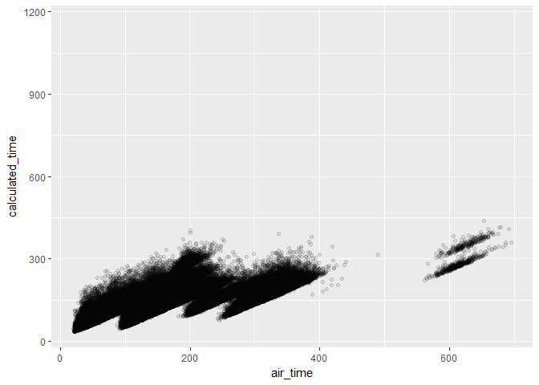
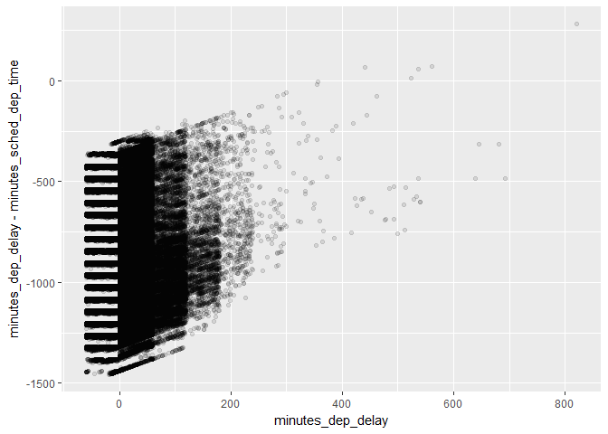

# Chapter 5: Data Transformation

In-class notes

`x %in% y` code will select every row where x is a value in y.

Missing values: confusing. NA is an unknown number. NaN is a nonsense result like 1/0 whose answer is not a real number.

Use `$` to indicate wanting one column like `flights$dep_time` but also in `tidyverse` you don't have to do this because you already called flights in these functions.

`lead()` and `lag()` return the vector offset by 1 either at the front or the end and adds NA there.

`%>%` is a pipe function. So in the terminal it's just `>`or `|`.

For changing the order of the columns, can use `arrange()` but also `mutate()`.


Note: Variable Types  
`int` = integers  
`dbl` = real numbers  
`chr` = strings  
`dttm` = date-time  
`lgl` = logical
`fctr` = categorical variables with fixed possible values  
`date` = dates  

Note: dplyr functions  
*Pick observations by value with `filter()`.
*Reorder rows with `select()`.
*Create new variables with functions of existing variables with `mutate()`.
*Collapse many values into a single summary with `summarise()`.
*Change the scope of the above functions from operating on entire dataset to group-by-group with `group()`.

These funtions all work similarly.  
1. first argument is a data frame  
2. subsequent arguments describe what to do with the data frame using variable names without quotes  
3. result is a new data frame  

### 5.2.4 Exercises  
**1. Find all the flights that**  
> 1. Had an arrival delay of two or more hours  
> 2. Flew to Houston (`IAH` or `HOU`)  
> 3. Were operated by United, American, or Delta  
> 4. Departed in summer (July, August, and September)  
> 5. Arrived more than two hours late, but didn't leave late  
> 6. Were delayed by at least an hour, but made up over 30 minutes in flight  
> 7. Departed between midnight and 6am (inclusive)


```r
filter(flights, arr_delay >= 120)
```

```
## # A tibble: 10,200 × 19
##     year month   day dep_time sched_dep_time dep_delay arr_time
##    <int> <int> <int>    <int>          <int>     <dbl>    <int>
## 1   2013     1     1      811            630       101     1047
## 2   2013     1     1      848           1835       853     1001
## 3   2013     1     1      957            733       144     1056
## 4   2013     1     1     1114            900       134     1447
## 5   2013     1     1     1505           1310       115     1638
## 6   2013     1     1     1525           1340       105     1831
## 7   2013     1     1     1549           1445        64     1912
## 8   2013     1     1     1558           1359       119     1718
## 9   2013     1     1     1732           1630        62     2028
## 10  2013     1     1     1803           1620       103     2008
## # ... with 10,190 more rows, and 12 more variables: sched_arr_time <int>,
## #   arr_delay <dbl>, carrier <chr>, flight <int>, tailnum <chr>,
## #   origin <chr>, dest <chr>, air_time <dbl>, distance <dbl>, hour <dbl>,
## #   minute <dbl>, time_hour <dttm>
```

```r
#an arrival delay of two or more hours, in minutes
```


```r
filter(flights, dest=='IAH' | dest=='HOU')
```

```
## # A tibble: 9,313 × 19
##     year month   day dep_time sched_dep_time dep_delay arr_time
##    <int> <int> <int>    <int>          <int>     <dbl>    <int>
## 1   2013     1     1      517            515         2      830
## 2   2013     1     1      533            529         4      850
## 3   2013     1     1      623            627        -4      933
## 4   2013     1     1      728            732        -4     1041
## 5   2013     1     1      739            739         0     1104
## 6   2013     1     1      908            908         0     1228
## 7   2013     1     1     1028           1026         2     1350
## 8   2013     1     1     1044           1045        -1     1352
## 9   2013     1     1     1114            900       134     1447
## 10  2013     1     1     1205           1200         5     1503
## # ... with 9,303 more rows, and 12 more variables: sched_arr_time <int>,
## #   arr_delay <dbl>, carrier <chr>, flight <int>, tailnum <chr>,
## #   origin <chr>, dest <chr>, air_time <dbl>, distance <dbl>, hour <dbl>,
## #   minute <dbl>, time_hour <dttm>
```

```r
#destination of IAH OR HOU
```


```r
filter(flights, carrier=='UA' | carrier=='AA' | carrier=='DL')
```

```
## # A tibble: 139,504 × 19
##     year month   day dep_time sched_dep_time dep_delay arr_time
##    <int> <int> <int>    <int>          <int>     <dbl>    <int>
## 1   2013     1     1      517            515         2      830
## 2   2013     1     1      533            529         4      850
## 3   2013     1     1      542            540         2      923
## 4   2013     1     1      554            600        -6      812
## 5   2013     1     1      554            558        -4      740
## 6   2013     1     1      558            600        -2      753
## 7   2013     1     1      558            600        -2      924
## 8   2013     1     1      558            600        -2      923
## 9   2013     1     1      559            600        -1      941
## 10  2013     1     1      559            600        -1      854
## # ... with 139,494 more rows, and 12 more variables: sched_arr_time <int>,
## #   arr_delay <dbl>, carrier <chr>, flight <int>, tailnum <chr>,
## #   origin <chr>, dest <chr>, air_time <dbl>, distance <dbl>, hour <dbl>,
## #   minute <dbl>, time_hour <dttm>
```

```r
#carrier United OR American OR Delta
```


```r
filter(flights, month %in% c(7,8,9))
```

```
## # A tibble: 86,326 × 19
##     year month   day dep_time sched_dep_time dep_delay arr_time
##    <int> <int> <int>    <int>          <int>     <dbl>    <int>
## 1   2013     7     1        1           2029       212      236
## 2   2013     7     1        2           2359         3      344
## 3   2013     7     1       29           2245       104      151
## 4   2013     7     1       43           2130       193      322
## 5   2013     7     1       44           2150       174      300
## 6   2013     7     1       46           2051       235      304
## 7   2013     7     1       48           2001       287      308
## 8   2013     7     1       58           2155       183      335
## 9   2013     7     1      100           2146       194      327
## 10  2013     7     1      100           2245       135      337
## # ... with 86,316 more rows, and 12 more variables: sched_arr_time <int>,
## #   arr_delay <dbl>, carrier <chr>, flight <int>, tailnum <chr>,
## #   origin <chr>, dest <chr>, air_time <dbl>, distance <dbl>, hour <dbl>,
## #   minute <dbl>, time_hour <dttm>
```

```r
#flights in months 7, 8, 9 (July, August, September)
```


```r
filter(flights, arr_delay >= 120 & dep_delay <= 0)
```

```
## # A tibble: 29 × 19
##     year month   day dep_time sched_dep_time dep_delay arr_time
##    <int> <int> <int>    <int>          <int>     <dbl>    <int>
## 1   2013     1    27     1419           1420        -1     1754
## 2   2013    10     7     1350           1350         0     1736
## 3   2013    10     7     1357           1359        -2     1858
## 4   2013    10    16      657            700        -3     1258
## 5   2013    11     1      658            700        -2     1329
## 6   2013     3    18     1844           1847        -3       39
## 7   2013     4    17     1635           1640        -5     2049
## 8   2013     4    18      558            600        -2     1149
## 9   2013     4    18      655            700        -5     1213
## 10  2013     5    22     1827           1830        -3     2217
## # ... with 19 more rows, and 12 more variables: sched_arr_time <int>,
## #   arr_delay <dbl>, carrier <chr>, flight <int>, tailnum <chr>,
## #   origin <chr>, dest <chr>, air_time <dbl>, distance <dbl>, hour <dbl>,
## #   minute <dbl>, time_hour <dttm>
```

```r
#flights that weren't delayed taking off but landed late
```


```r
filter(flights, dep_delay >= 60 & dep_delay- arr_delay > 30)
```

```
## # A tibble: 1,844 × 19
##     year month   day dep_time sched_dep_time dep_delay arr_time
##    <int> <int> <int>    <int>          <int>     <dbl>    <int>
## 1   2013     1     1     2205           1720       285       46
## 2   2013     1     1     2326           2130       116      131
## 3   2013     1     3     1503           1221       162     1803
## 4   2013     1     3     1839           1700        99     2056
## 5   2013     1     3     1850           1745        65     2148
## 6   2013     1     3     1941           1759       102     2246
## 7   2013     1     3     1950           1845        65     2228
## 8   2013     1     3     2015           1915        60     2135
## 9   2013     1     3     2257           2000       177       45
## 10  2013     1     4     1917           1700       137     2135
## # ... with 1,834 more rows, and 12 more variables: sched_arr_time <int>,
## #   arr_delay <dbl>, carrier <chr>, flight <int>, tailnum <chr>,
## #   origin <chr>, dest <chr>, air_time <dbl>, distance <dbl>, hour <dbl>,
## #   minute <dbl>, time_hour <dttm>
```

```r
#flights that left more than an hour late but made up delay to within 30 minutes during flight
```


```r
filter(flights, dep_time == 2400 | dep_time <= 0600)
```

```
## # A tibble: 9,373 × 19
##     year month   day dep_time sched_dep_time dep_delay arr_time
##    <int> <int> <int>    <int>          <int>     <dbl>    <int>
## 1   2013     1     1      517            515         2      830
## 2   2013     1     1      533            529         4      850
## 3   2013     1     1      542            540         2      923
## 4   2013     1     1      544            545        -1     1004
## 5   2013     1     1      554            600        -6      812
## 6   2013     1     1      554            558        -4      740
## 7   2013     1     1      555            600        -5      913
## 8   2013     1     1      557            600        -3      709
## 9   2013     1     1      557            600        -3      838
## 10  2013     1     1      558            600        -2      753
## # ... with 9,363 more rows, and 12 more variables: sched_arr_time <int>,
## #   arr_delay <dbl>, carrier <chr>, flight <int>, tailnum <chr>,
## #   origin <chr>, dest <chr>, air_time <dbl>, distance <dbl>, hour <dbl>,
## #   minute <dbl>, time_hour <dttm>
```

```r
#flights that left at midnight OR before/at 6am in 24hr time
```


**2. Another useful dplyr filtering helper is `between()`. What does it do? Can you use it to simplify the code needed to answer the previous challenges?**

```r
filter(flights, between(dep_delay, 0, 120))
```

```
## # A tibble: 135,223 × 19
##     year month   day dep_time sched_dep_time dep_delay arr_time
##    <int> <int> <int>    <int>          <int>     <dbl>    <int>
## 1   2013     1     1      517            515         2      830
## 2   2013     1     1      533            529         4      850
## 3   2013     1     1      542            540         2      923
## 4   2013     1     1      559            559         0      702
## 5   2013     1     1      600            600         0      851
## 6   2013     1     1      600            600         0      837
## 7   2013     1     1      601            600         1      844
## 8   2013     1     1      607            607         0      858
## 9   2013     1     1      608            600         8      807
## 10  2013     1     1      611            600        11      945
## # ... with 135,213 more rows, and 12 more variables: sched_arr_time <int>,
## #   arr_delay <dbl>, carrier <chr>, flight <int>, tailnum <chr>,
## #   origin <chr>, dest <chr>, air_time <dbl>, distance <dbl>, hour <dbl>,
## #   minute <dbl>, time_hour <dttm>
```

_This produces a tibble of flights that have a take off delay between 0 and 120 minutes._

**3. How many flights have a missing `dep_time`? What other variables are missing? What might these rows represent?**
Running `summary` on the data set will tell you how many NAs there are in `dep_time`.


```r
summary(flights)
```

```
##       year          month             day           dep_time   
##  Min.   :2013   Min.   : 1.000   Min.   : 1.00   Min.   :   1  
##  1st Qu.:2013   1st Qu.: 4.000   1st Qu.: 8.00   1st Qu.: 907  
##  Median :2013   Median : 7.000   Median :16.00   Median :1401  
##  Mean   :2013   Mean   : 6.549   Mean   :15.71   Mean   :1349  
##  3rd Qu.:2013   3rd Qu.:10.000   3rd Qu.:23.00   3rd Qu.:1744  
##  Max.   :2013   Max.   :12.000   Max.   :31.00   Max.   :2400  
##                                                  NA's   :8255  
##  sched_dep_time   dep_delay          arr_time    sched_arr_time
##  Min.   : 106   Min.   : -43.00   Min.   :   1   Min.   :   1  
##  1st Qu.: 906   1st Qu.:  -5.00   1st Qu.:1104   1st Qu.:1124  
##  Median :1359   Median :  -2.00   Median :1535   Median :1556  
##  Mean   :1344   Mean   :  12.64   Mean   :1502   Mean   :1536  
##  3rd Qu.:1729   3rd Qu.:  11.00   3rd Qu.:1940   3rd Qu.:1945  
##  Max.   :2359   Max.   :1301.00   Max.   :2400   Max.   :2359  
##                 NA's   :8255      NA's   :8713                 
##    arr_delay          carrier              flight       tailnum         
##  Min.   : -86.000   Length:336776      Min.   :   1   Length:336776     
##  1st Qu.: -17.000   Class :character   1st Qu.: 553   Class :character  
##  Median :  -5.000   Mode  :character   Median :1496   Mode  :character  
##  Mean   :   6.895                      Mean   :1972                     
##  3rd Qu.:  14.000                      3rd Qu.:3465                     
##  Max.   :1272.000                      Max.   :8500                     
##  NA's   :9430                                                           
##     origin              dest              air_time        distance   
##  Length:336776      Length:336776      Min.   : 20.0   Min.   :  17  
##  Class :character   Class :character   1st Qu.: 82.0   1st Qu.: 502  
##  Mode  :character   Mode  :character   Median :129.0   Median : 872  
##                                        Mean   :150.7   Mean   :1040  
##                                        3rd Qu.:192.0   3rd Qu.:1389  
##                                        Max.   :695.0   Max.   :4983  
##                                        NA's   :9430                  
##       hour           minute        time_hour                  
##  Min.   : 1.00   Min.   : 0.00   Min.   :2013-01-01 05:00:00  
##  1st Qu.: 9.00   1st Qu.: 8.00   1st Qu.:2013-04-04 13:00:00  
##  Median :13.00   Median :29.00   Median :2013-07-03 10:00:00  
##  Mean   :13.18   Mean   :26.23   Mean   :2013-07-03 05:02:36  
##  3rd Qu.:17.00   3rd Qu.:44.00   3rd Qu.:2013-10-01 07:00:00  
##  Max.   :23.00   Max.   :59.00   Max.   :2013-12-31 23:00:00  
## 
```

_There are 8,255_ `NA` _in_ `dep_time`.

**4. Why is `NA^0` not missing? Why is `NA | TRUE` not missing? Why is `FALSE & NA` not missing? Can you figure out the general rule?**
_NA^0 will return 1 due to the 0 always returning 1 if anything is raised to it. But for_ `NA | TRUE` _where we are asking NA or True, we're just asking R to pick between "Idk" and "True" so it will always return_ `TRUE`. _Same logic applies to the_ `FALSE & NA`. _But_ `NA*0` _returns_ `NA` _because we still don't know if NA is a real number. If it turns out to be infinity, then R would return NaN but because we don't know if it's infinity it returns NA._

### 5.3.1 Exercises
**1. How could use `arrange()` to sort all missing values to the start?**

```r
arrange(flights, desc(is.na(dep_time)))
```

```
## # A tibble: 336,776 × 19
##     year month   day dep_time sched_dep_time dep_delay arr_time
##    <int> <int> <int>    <int>          <int>     <dbl>    <int>
## 1   2013     1     1       NA           1630        NA       NA
## 2   2013     1     1       NA           1935        NA       NA
## 3   2013     1     1       NA           1500        NA       NA
## 4   2013     1     1       NA            600        NA       NA
## 5   2013     1     2       NA           1540        NA       NA
## 6   2013     1     2       NA           1620        NA       NA
## 7   2013     1     2       NA           1355        NA       NA
## 8   2013     1     2       NA           1420        NA       NA
## 9   2013     1     2       NA           1321        NA       NA
## 10  2013     1     2       NA           1545        NA       NA
## # ... with 336,766 more rows, and 12 more variables: sched_arr_time <int>,
## #   arr_delay <dbl>, carrier <chr>, flight <int>, tailnum <chr>,
## #   origin <chr>, dest <chr>, air_time <dbl>, distance <dbl>, hour <dbl>,
## #   minute <dbl>, time_hour <dttm>
```

```r
#desc means descending order. Because I nested is.na() in desc(), the output will have NA at the top of the list based on NAs in dep_time.
```


**2. Sort `flights` to find the most delayed flights. Find the flights that left the earliest.**

```r
arrange(flights, desc(dep_delay))
```

```
## # A tibble: 336,776 × 19
##     year month   day dep_time sched_dep_time dep_delay arr_time
##    <int> <int> <int>    <int>          <int>     <dbl>    <int>
## 1   2013     1     9      641            900      1301     1242
## 2   2013     6    15     1432           1935      1137     1607
## 3   2013     1    10     1121           1635      1126     1239
## 4   2013     9    20     1139           1845      1014     1457
## 5   2013     7    22      845           1600      1005     1044
## 6   2013     4    10     1100           1900       960     1342
## 7   2013     3    17     2321            810       911      135
## 8   2013     6    27      959           1900       899     1236
## 9   2013     7    22     2257            759       898      121
## 10  2013    12     5      756           1700       896     1058
## # ... with 336,766 more rows, and 12 more variables: sched_arr_time <int>,
## #   arr_delay <dbl>, carrier <chr>, flight <int>, tailnum <chr>,
## #   origin <chr>, dest <chr>, air_time <dbl>, distance <dbl>, hour <dbl>,
## #   minute <dbl>, time_hour <dttm>
```

```r
arrange(flights, dep_time)
```

```
## # A tibble: 336,776 × 19
##     year month   day dep_time sched_dep_time dep_delay arr_time
##    <int> <int> <int>    <int>          <int>     <dbl>    <int>
## 1   2013     1    13        1           2249        72      108
## 2   2013     1    31        1           2100       181      124
## 3   2013    11    13        1           2359         2      442
## 4   2013    12    16        1           2359         2      447
## 5   2013    12    20        1           2359         2      430
## 6   2013    12    26        1           2359         2      437
## 7   2013    12    30        1           2359         2      441
## 8   2013     2    11        1           2100       181      111
## 9   2013     2    24        1           2245        76      121
## 10  2013     3     8        1           2355         6      431
## # ... with 336,766 more rows, and 12 more variables: sched_arr_time <int>,
## #   arr_delay <dbl>, carrier <chr>, flight <int>, tailnum <chr>,
## #   origin <chr>, dest <chr>, air_time <dbl>, distance <dbl>, hour <dbl>,
## #   minute <dbl>, time_hour <dttm>
```

```r
#following the same logic as above, desc() will sort based on descending order of the departure delay.
```


**3. Sort `flights` to find the fastest flights.**

```r
arrange(flights, air_time)
```

```
## # A tibble: 336,776 × 19
##     year month   day dep_time sched_dep_time dep_delay arr_time
##    <int> <int> <int>    <int>          <int>     <dbl>    <int>
## 1   2013     1    16     1355           1315        40     1442
## 2   2013     4    13      537            527        10      622
## 3   2013    12     6      922            851        31     1021
## 4   2013     2     3     2153           2129        24     2247
## 5   2013     2     5     1303           1315       -12     1342
## 6   2013     2    12     2123           2130        -7     2211
## 7   2013     3     2     1450           1500       -10     1547
## 8   2013     3     8     2026           1935        51     2131
## 9   2013     3    18     1456           1329        87     1533
## 10  2013     3    19     2226           2145        41     2305
## # ... with 336,766 more rows, and 12 more variables: sched_arr_time <int>,
## #   arr_delay <dbl>, carrier <chr>, flight <int>, tailnum <chr>,
## #   origin <chr>, dest <chr>, air_time <dbl>, distance <dbl>, hour <dbl>,
## #   minute <dbl>, time_hour <dttm>
```


**4. Which flights travelled the longest? Which travelled the shortest?**

```r
arrange(flights, distance)
```

```
## # A tibble: 336,776 × 19
##     year month   day dep_time sched_dep_time dep_delay arr_time
##    <int> <int> <int>    <int>          <int>     <dbl>    <int>
## 1   2013     7    27       NA            106        NA       NA
## 2   2013     1     3     2127           2129        -2     2222
## 3   2013     1     4     1240           1200        40     1333
## 4   2013     1     4     1829           1615       134     1937
## 5   2013     1     4     2128           2129        -1     2218
## 6   2013     1     5     1155           1200        -5     1241
## 7   2013     1     6     2125           2129        -4     2224
## 8   2013     1     7     2124           2129        -5     2212
## 9   2013     1     8     2127           2130        -3     2304
## 10  2013     1     9     2126           2129        -3     2217
## # ... with 336,766 more rows, and 12 more variables: sched_arr_time <int>,
## #   arr_delay <dbl>, carrier <chr>, flight <int>, tailnum <chr>,
## #   origin <chr>, dest <chr>, air_time <dbl>, distance <dbl>, hour <dbl>,
## #   minute <dbl>, time_hour <dttm>
```


### 5.4.1 Exercises
**1. Brainstorm as many ways as possible to select `dep_time`, `dep_delay`, `arr_time`, and `arr_delay` from `flights`.**

```r
select(flights, dep_time, dep_delay, arr_time, arr_delay)
```

```
## # A tibble: 336,776 × 4
##    dep_time dep_delay arr_time arr_delay
##       <int>     <dbl>    <int>     <dbl>
## 1       517         2      830        11
## 2       533         4      850        20
## 3       542         2      923        33
## 4       544        -1     1004       -18
## 5       554        -6      812       -25
## 6       554        -4      740        12
## 7       555        -5      913        19
## 8       557        -3      709       -14
## 9       557        -3      838        -8
## 10      558        -2      753         8
## # ... with 336,766 more rows
```


```r
select(flights, starts_with("dep"), starts_with("arr"))
```

```
## # A tibble: 336,776 × 4
##    dep_time dep_delay arr_time arr_delay
##       <int>     <dbl>    <int>     <dbl>
## 1       517         2      830        11
## 2       533         4      850        20
## 3       542         2      923        33
## 4       544        -1     1004       -18
## 5       554        -6      812       -25
## 6       554        -4      740        12
## 7       555        -5      913        19
## 8       557        -3      709       -14
## 9       557        -3      838        -8
## 10      558        -2      753         8
## # ... with 336,766 more rows
```

```r
#Another way
```

**2. What happens if you include the name of a variable multiple times in a `select()` call?**
`select()` _just ignores the repeats._

**3. What does `one_of()` do? Why might it be helpful in conjunction with this vector?**

```r
vars <- c("year", "month", "day", "dep_delay", "arr_delay")
```


```r
select(flights, one_of(vars))
```

```
## # A tibble: 336,776 × 5
##     year month   day dep_delay arr_delay
##    <int> <int> <int>     <dbl>     <dbl>
## 1   2013     1     1         2        11
## 2   2013     1     1         4        20
## 3   2013     1     1         2        33
## 4   2013     1     1        -1       -18
## 5   2013     1     1        -6       -25
## 6   2013     1     1        -4        12
## 7   2013     1     1        -5        19
## 8   2013     1     1        -3       -14
## 9   2013     1     1        -3        -8
## 10  2013     1     1        -2         8
## # ... with 336,766 more rows
```


_Misnomer! This function just selects them all, not one of them as the name implies._

**4. Does the result of running the following code surprise you? How do the select helpers deal with case by default? How can you change that default?**

```r
select(flights, contains("TIME"))
```

```
## # A tibble: 336,776 × 6
##    dep_time sched_dep_time arr_time sched_arr_time air_time
##       <int>          <int>    <int>          <int>    <dbl>
## 1       517            515      830            819      227
## 2       533            529      850            830      227
## 3       542            540      923            850      160
## 4       544            545     1004           1022      183
## 5       554            600      812            837      116
## 6       554            558      740            728      150
## 7       555            600      913            854      158
## 8       557            600      709            723       53
## 9       557            600      838            846      140
## 10      558            600      753            745      138
## # ... with 336,766 more rows, and 1 more variables: time_hour <dttm>
```

_Surprising because usually R is case-sensitive. Can change that with_ `ignore.case`.


### 5.5.2 Exercises
**1. Currently `dep_time` and `sched_dep_time` are convenient to look at, but hard to compute because they're not really continuous numbers. Convert them to a more convenient representation of number of minutes since midnight.**
_Convert the time to minutes since midnight using_ `mutate()` _or_ `transmutate()`.

```r
flight_minutes1 <- transmute(flights, minutes_dep_time = dep_time %/% 100 * 60 + dep_time %% 100, minutes_sched_dep_time = sched_dep_time %/% 100 * 60 + sched_dep_time %% 100)

head(flight_minutes1)
```

```
## # A tibble: 6 × 2
##   minutes_dep_time minutes_sched_dep_time
##              <dbl>                  <dbl>
## 1              317                    315
## 2              333                    329
## 3              342                    340
## 4              344                    345
## 5              354                    360
## 6              354                    358
```

**2. Compare `air_time` with `arr_time - dep_time`. What do you expect to see? What do you see? What do you need to do to fix it?**
_Use_ `transmute()` _for a side-by-side comparison. I would expect to see that they are the same. Can use_ `ifelse()` _to handle some of the issues. The issues include handling time zones, taking off and landing on different days. Plotting to visualize the data really helps here._

```r
flight_minutes2 <- transmute(flights, minutes_dep_time = dep_time %/% 100 * 60 + dep_time %% 100, minutes_arr_time = arr_time %/% 100 * 60 + arr_time %% 100, minutes_air_time = air_time %/% 100 * 60 + air_time %% 100, calculated_time = ifelse(minutes_arr_time < minutes_dep_time, minutes_arr_time-minutes_dep_time + 1440, minutes_arr_time-minutes_dep_time), air_time)

head(flight_minutes2)
```

```
## # A tibble: 6 × 5
##   minutes_dep_time minutes_arr_time minutes_air_time calculated_time
##              <dbl>            <dbl>            <dbl>           <dbl>
## 1              317              510              147             193
## 2              333              530              147             197
## 3              342              563              120             221
## 4              344              604              143             260
## 5              354              492               76             138
## 6              354              460              110             106
## # ... with 1 more variables: air_time <dbl>
```


```r
ggplot(flight_minutes2, aes(x=air_time, y=calculated_time)) + geom_point(alpha=0.1)
```

```
## Warning: Removed 9430 rows containing missing values (geom_point).
```

<!-- -->

_Better. I didn't address all problems that could have led to the difference._

**3. Compare `dep_time`, `sched_dep_time`, and `dep_delay`. How would you expect those three numbers to be related?**
`dep_delay` _should be the difference between_ `dep_time` _and_ `sched_dep_time`. _Be sure to convert to minutes and account for the issues in question 2 as well as those flights that leave early._


```r
flight_minutes3 <- transmute(flights, minutes_dep_delay = dep_delay %/% 100 * 60 + dep_time %% 100, minutes_sched_dep_time = sched_dep_time %/% 100 * 60 + sched_dep_time %% 100, calculated_time = ifelse(minutes_dep_delay+120 < minutes_sched_dep_time, minutes_dep_delay-minutes_sched_dep_time + 1440, minutes_dep_delay-minutes_sched_dep_time))

head(flight_minutes3)
```

```
## # A tibble: 6 × 3
##   minutes_dep_delay minutes_sched_dep_time calculated_time
##               <dbl>                  <dbl>           <dbl>
## 1                17                    315            1142
## 2                33                    329            1144
## 3                42                    340            1142
## 4               -16                    345            1079
## 5                -6                    360            1074
## 6                -6                    358            1076
```


```r
ggplot(flight_minutes3, aes(x=minutes_dep_delay, y=minutes_dep_delay-minutes_sched_dep_time)) + geom_point(alpha=0.1)
```

```
## Warning: Removed 8255 rows containing missing values (geom_point).
```

<!-- -->


**4. Find the 10 most delayed flights using a ranking function. How do you want to handle ties? Carefully read the documentation for `min_rank()`.**

```r
#make a smaller dataset for ease of use
ranking <- select(flights, carrier, flight, sched_dep_time, dep_delay, dep_time)

#do the ranking.
ranking <- mutate(ranking, delay_rank = min_rank(desc(dep_delay)))

#arrange based on the ranking
ranking <- arrange(ranking, delay_rank, carrier, flight)
head(ranking, n=10)
```

```
## # A tibble: 10 × 6
##    carrier flight sched_dep_time dep_delay dep_time delay_rank
##      <chr>  <int>          <int>     <dbl>    <int>      <int>
## 1       HA     51            900      1301      641          1
## 2       MQ   3535           1935      1137     1432          2
## 3       MQ   3695           1635      1126     1121          3
## 4       AA    177           1845      1014     1139          4
## 5       MQ   3075           1600      1005      845          5
## 6       DL   2391           1900       960     1100          6
## 7       DL   2119            810       911     2321          7
## 8       DL   2007           1900       899      959          8
## 9       DL   2047            759       898     2257          9
## 10      AA    172           1700       896      756         10
```

_The ranking isn't quite what I expected. I was expecting to have an actual ranking like 1, 2, 3, etc._

**5. What does `1:3 + 1:10` return? Why?**

```r
1:3 + 1:10
```

```
## Warning in 1:3 + 1:10: longer object length is not a multiple of shorter
## object length
```

```
##  [1]  2  4  6  5  7  9  8 10 12 11
```

_It gives a weird error. And then also 1, 2, and 3 are added to part of_ `1:10` _because the objects are different lengths and_ `1:3` _can't be repeated through the_ `1:10` _because it's not a multiple. What about this:_


```r
1:3 + 1:9
```

```
## [1]  2  4  6  5  7  9  8 10 12
```

_This works because 9 is a multiple of 3._

**6. What trigonometric functions does R provide?**
_Use_ `?trig` _to find out!_

```r
?Trig
```

```
## starting httpd help server ...
```

```
##  done
```

