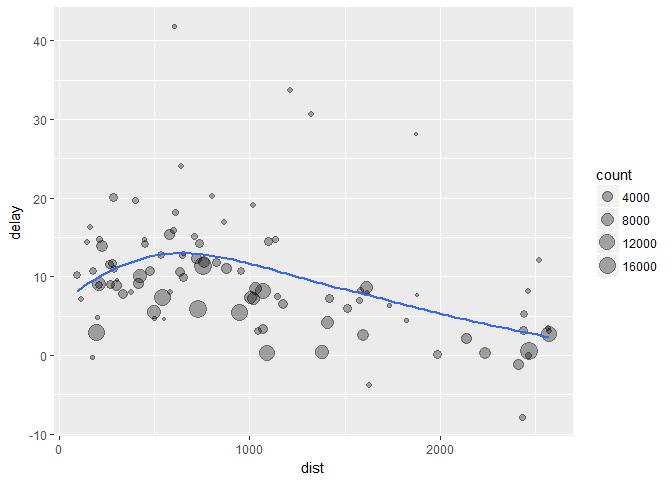
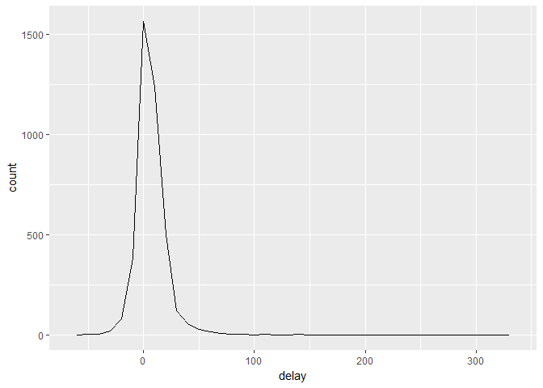
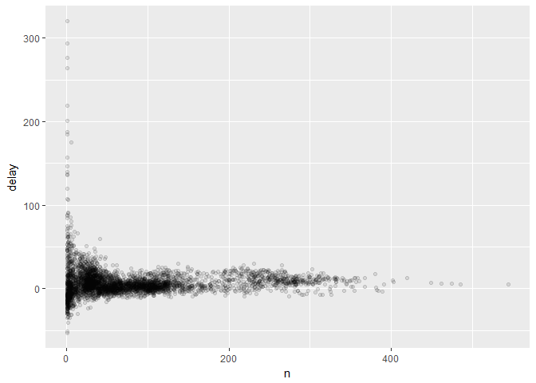
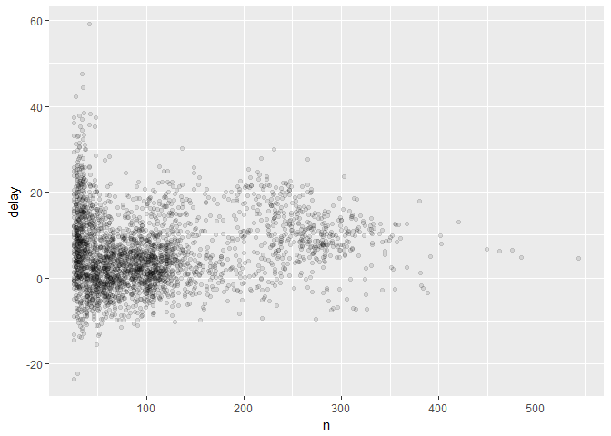

# Chapter 5: Data Transformation, Continued


## 5.6 Grouped summaries with `summarise()`

`summarise()` collapses data frames to a single row. Example:

```r
summarise(flights, delay = mean(dep_delay, na.rm = TRUE))
```

```
## # A tibble: 1 × 1
##      delay
##      <dbl>
## 1 12.63907
```

`summarise()` is more useful when used with `group_by()` because it analyzes individual groups instead of the whole dataset. Example:

```r
#Get average delay per date
by_day <- group_by(flights, year, month, day)
summarise(by_day, delay = mean(dep_delay, na.rm = TRUE))
```

```
## Source: local data frame [365 x 4]
## Groups: year, month [?]
## 
##     year month   day     delay
##    <int> <int> <int>     <dbl>
## 1   2013     1     1 11.548926
## 2   2013     1     2 13.858824
## 3   2013     1     3 10.987832
## 4   2013     1     4  8.951595
## 5   2013     1     5  5.732218
## 6   2013     1     6  7.148014
## 7   2013     1     7  5.417204
## 8   2013     1     8  2.553073
## 9   2013     1     9  2.276477
## 10  2013     1    10  2.844995
## # ... with 355 more rows
```

### 5.6.1 Combining multiple operations with the pipe

Can do it this way:

```r
by_dest <- group_by(flights, dest)
delay <- summarise(by_dest,
  count = n(),
  dist = mean(distance, na.rm = TRUE),
  delay = mean(arr_delay, na.rm = TRUE)
)
delay <- filter(delay, count > 20, dest != "HNL")

# It looks like delays increase with distance up to ~750 miles 
# and then decrease. Maybe as flights get longer there's more 
# ability to make up delays in the air?
ggplot(data = delay, mapping = aes(x = dist, y = delay)) +
  geom_point(aes(size = count), alpha = 1/3) +
  geom_smooth(se = FALSE)
```

```
## `geom_smooth()` using method = 'loess'
```

<!-- -->

```r
#> `geom_smooth()` using method = 'loess'
```

Where there are three steps to prepare the data: group flights by destination; summarise to compute distance, average delay, and number of flights; filter to remove noisy points and Honolulu airport, which is almost twice as far away as the next closest airport. Try again using the pipe (`%>%`):

```r
delays <- flights %>% 
  group_by(dest) %>% 
  summarise(
    count = n(),
    dist = mean(distance, na.rm = TRUE),
    delay = mean(arr_delay, na.rm = TRUE)
  ) %>% 
  filter(count > 20, dest != "HNL")
```

This reads group, then summarise, then filter. This vastly improves the readability of the code. BUT `ggplot2` does not work with the pipe.

### 5.6.2 Missing values

All aggregation functions have an `na.rm` argument. 

### 5.6.3 Counts

It is good practice to either count `n()` or count non-missing values `sum(!is.na(x))` to make sure conclusions aren't drawn on small amounts of data. Example:

```r
not_cancelled <- flights %>% 
  filter(!is.na(dep_delay), !is.na(arr_delay))

delays <- not_cancelled %>% 
  group_by(tailnum) %>% 
  summarise(
    delay = mean(arr_delay)
  )

ggplot(data = delays, mapping = aes(x = delay)) + 
  geom_freqpoly(binwidth = 10)
```

<!-- -->

Get more insight if you plot the number of flights vs average delay:

```r
delays <- not_cancelled %>% 
  group_by(tailnum) %>% 
  summarise(
    delay = mean(arr_delay, na.rm = TRUE),
    n = n()
  )

ggplot(data = delays, mapping = aes(x = n, y = delay)) + 
  geom_point(alpha = 1/10)
```

<!-- -->

There is greater variation in the average delay when there are few flights. When you plot a mean (or other summary) vs group size, variation decreases as the sample size increases. Can also filter out groups that are small:

```r
delays %>% 
  filter(n > 25) %>% 
  ggplot(mapping = aes(x = n, y = delay)) + 
    geom_point(alpha = 1/10)
```

<!-- -->


There's another common variation of this type of pattern. When plotting the skill of the batter (measured by batting average `ba`) against the number of opportunities to hit the ball (measured by at bat `ab`), there are two patterns:  
1. The variation in our aggregate decreases as we get more data points.  
2. There's a positive correlation between skill `ba` and opportunities to hit the ball `ab` because the teams control who gets to play.  

```r
# Convert to a tibble so it prints nicely
batting <- as_tibble(Lahman::Batting)

batters <- batting %>% 
  group_by(playerID) %>% 
  summarise(
    ba = sum(H, na.rm = TRUE) / sum(AB, na.rm = TRUE),
    ab = sum(AB, na.rm = TRUE)
  )

batters %>% 
  filter(ab > 100) %>% 
  ggplot(mapping = aes(x = ab, y = ba)) +
    geom_point() + 
    geom_smooth(se = FALSE)
```

```
## `geom_smooth()` using method = 'gam'
```

<!-- -->

```r
#> `geom_smooth()` using method = 'gam'
```


This has important implications for ranking. Sorting on `desc(ba)`, these players are lucky, not skilled:

```r
batters %>% 
  arrange(desc(ba))
```

```
## # A tibble: 18,659 × 3
##     playerID    ba    ab
##        <chr> <dbl> <int>
## 1  abramge01     1     1
## 2  banisje01     1     1
## 3  bartocl01     1     1
## 4   bassdo01     1     1
## 5  birasst01     1     2
## 6  bruneju01     1     1
## 7  burnscb01     1     1
## 8  cammaer01     1     1
## 9   campsh01     1     1
## 10 crockcl01     1     1
## # ... with 18,649 more rows
```

### 5.6.4 Useful summary functions

Measures of location: `mean(x)` which is the sum divided by the length or `median(x)` where 50% of `x` is above it and 50% is below it.  

Sometimes can be useful to combine aggregation with subsetting (which we haven't learned about yet):

```r
not_cancelled %>% 
  group_by(year, month, day) %>% 
  summarise(
    avg_delay1 = mean(arr_delay),
    avg_delay2 = mean(arr_delay[arr_delay > 0]) # the average positive delay
  )
```

```
## Source: local data frame [365 x 5]
## Groups: year, month [?]
## 
##     year month   day avg_delay1 avg_delay2
##    <int> <int> <int>      <dbl>      <dbl>
## 1   2013     1     1 12.6510229   32.48156
## 2   2013     1     2 12.6928879   32.02991
## 3   2013     1     3  5.7333333   27.66087
## 4   2013     1     4 -1.9328194   28.30976
## 5   2013     1     5 -1.5258020   22.55882
## 6   2013     1     6  4.2364294   24.37270
## 7   2013     1     7 -4.9473118   27.76132
## 8   2013     1     8 -3.2275785   20.78909
## 9   2013     1     9 -0.2642777   25.63415
## 10  2013     1    10 -5.8988159   27.34545
## # ... with 355 more rows
```

Measures of spread: `sd(x)` which is the standard deviation, `IQR(x)` which is the interquartile range, or `mad(x)` which is the median absolute deviation. `IQR(x)` and `mad(x)` are rough equivalents that are more useful if there are outliers in the data.


```r
# Why is distance to some destinations more variable than to others?
not_cancelled %>% 
  group_by(dest) %>% 
  summarise(distance_sd = sd(distance)) %>% 
  arrange(desc(distance_sd))
```

```
## # A tibble: 104 × 2
##     dest distance_sd
##    <chr>       <dbl>
## 1    EGE   10.542765
## 2    SAN   10.350094
## 3    SFO   10.216017
## 4    HNL   10.004197
## 5    SEA    9.977993
## 6    LAS    9.907786
## 7    PDX    9.873299
## 8    PHX    9.862546
## 9    LAX    9.657195
## 10   IND    9.458066
## # ... with 94 more rows
```

Measures of rank: `min(x)`, `quantile(x, 0.25)` which is a generalization of the median (specifically here it will find a value of `x` that is greater than 25% of the values and less than the remaining 75%), or `max(x)`.

```r
# When do the first and last flights leave each day?
not_cancelled %>% 
  group_by(year, month, day) %>% 
  summarise(
    first = min(dep_time),
    last = max(dep_time)
  )
```

```
## Source: local data frame [365 x 5]
## Groups: year, month [?]
## 
##     year month   day first  last
##    <int> <int> <int> <int> <int>
## 1   2013     1     1   517  2356
## 2   2013     1     2    42  2354
## 3   2013     1     3    32  2349
## 4   2013     1     4    25  2358
## 5   2013     1     5    14  2357
## 6   2013     1     6    16  2355
## 7   2013     1     7    49  2359
## 8   2013     1     8   454  2351
## 9   2013     1     9     2  2252
## 10  2013     1    10     3  2320
## # ... with 355 more rows
```

Measures of position: `first(x)`, `nth(x, 2)`, or `last(x)`. Work similarly to `x[1]`, `x[2]`, and `x[length(x)]` but lets you set a default value if that position does not exist ((i.e. you’re trying to get the 3rd element from a group that only has two elements).

```r
#Find first and last departure for each day
not_cancelled %>% 
  group_by(year, month, day) %>% 
  summarise(
    first_dep = first(dep_time), 
    last_dep = last(dep_time)
  )
```

```
## Source: local data frame [365 x 5]
## Groups: year, month [?]
## 
##     year month   day first_dep last_dep
##    <int> <int> <int>     <int>    <int>
## 1   2013     1     1       517     2356
## 2   2013     1     2        42     2354
## 3   2013     1     3        32     2349
## 4   2013     1     4        25     2358
## 5   2013     1     5        14     2357
## 6   2013     1     6        16     2355
## 7   2013     1     7        49     2359
## 8   2013     1     8       454     2351
## 9   2013     1     9         2     2252
## 10  2013     1    10         3     2320
## # ... with 355 more rows
```

These are complemenary to filtering on ranks:

```r
not_cancelled %>% 
  group_by(year, month, day) %>% 
  mutate(r = min_rank(desc(dep_time))) %>% 
  filter(r %in% range(r))
```

```
## Source: local data frame [770 x 20]
## Groups: year, month, day [365]
## 
##     year month   day dep_time sched_dep_time dep_delay arr_time
##    <int> <int> <int>    <int>          <int>     <dbl>    <int>
## 1   2013     1     1      517            515         2      830
## 2   2013     1     1     2356           2359        -3      425
## 3   2013     1     2       42           2359        43      518
## 4   2013     1     2     2354           2359        -5      413
## 5   2013     1     3       32           2359        33      504
## 6   2013     1     3     2349           2359       -10      434
## 7   2013     1     4       25           2359        26      505
## 8   2013     1     4     2358           2359        -1      429
## 9   2013     1     4     2358           2359        -1      436
## 10  2013     1     5       14           2359        15      503
## # ... with 760 more rows, and 13 more variables: sched_arr_time <int>,
## #   arr_delay <dbl>, carrier <chr>, flight <int>, tailnum <chr>,
## #   origin <chr>, dest <chr>, air_time <dbl>, distance <dbl>, hour <dbl>,
## #   minute <dbl>, time_hour <dttm>, r <int>
```

Counts: `n()` which takes no arguments and returns the size of the current group. For number of non-missing values use `sum(!is.na(x))`. For number of unique values use `n_distinct(x)`.

```r
# Which destinations have the most carriers?
not_cancelled %>% 
  group_by(dest) %>% 
  summarise(carriers = n_distinct(carrier)) %>% 
  arrange(desc(carriers))
```

```
## # A tibble: 104 × 2
##     dest carriers
##    <chr>    <int>
## 1    ATL        7
## 2    BOS        7
## 3    CLT        7
## 4    ORD        7
## 5    TPA        7
## 6    AUS        6
## 7    DCA        6
## 8    DTW        6
## 9    IAD        6
## 10   MSP        6
## # ... with 94 more rows
```

If all you want is count:

```r
not_cancelled %>% 
  count(dest)
```

```
## # A tibble: 104 × 2
##     dest     n
##    <chr> <int>
## 1    ABQ   254
## 2    ACK   264
## 3    ALB   418
## 4    ANC     8
## 5    ATL 16837
## 6    AUS  2411
## 7    AVL   261
## 8    BDL   412
## 9    BGR   358
## 10   BHM   269
## # ... with 94 more rows
```

If you want to weight a variable:

```r
#Total number of miles a plane flew
not_cancelled %>% 
  count(tailnum, wt = distance)
```

```
## # A tibble: 4,037 × 2
##    tailnum      n
##      <chr>  <dbl>
## 1   D942DN   3418
## 2   N0EGMQ 239143
## 3   N10156 109664
## 4   N102UW  25722
## 5   N103US  24619
## 6   N104UW  24616
## 7   N10575 139903
## 8   N105UW  23618
## 9   N107US  21677
## 10  N108UW  32070
## # ... with 4,027 more rows
```

Counts and proportions of logical values: `sum(x>10)` or `mean(y==0)`. When used with numeric functions `TRUE` is converted to 1 and `FALSE` to 0 making `sum(x)` give number of `TRUE` in `x` and `mean(x)` gives proportion.

```r
# How many flights left before 5am? (these usually indicate delayed
# flights from the previous day)
not_cancelled %>% 
  group_by(year, month, day) %>% 
  summarise(n_early = sum(dep_time < 500))
```

```
## Source: local data frame [365 x 4]
## Groups: year, month [?]
## 
##     year month   day n_early
##    <int> <int> <int>   <int>
## 1   2013     1     1       0
## 2   2013     1     2       3
## 3   2013     1     3       4
## 4   2013     1     4       3
## 5   2013     1     5       3
## 6   2013     1     6       2
## 7   2013     1     7       2
## 8   2013     1     8       1
## 9   2013     1     9       3
## 10  2013     1    10       3
## # ... with 355 more rows
```

```r
# What proportion of flights are delayed by more than an hour?
not_cancelled %>% 
  group_by(year, month, day) %>% 
  summarise(hour_perc = mean(arr_delay > 60))
```

```
## Source: local data frame [365 x 4]
## Groups: year, month [?]
## 
##     year month   day  hour_perc
##    <int> <int> <int>      <dbl>
## 1   2013     1     1 0.07220217
## 2   2013     1     2 0.08512931
## 3   2013     1     3 0.05666667
## 4   2013     1     4 0.03964758
## 5   2013     1     5 0.03486750
## 6   2013     1     6 0.04704463
## 7   2013     1     7 0.03333333
## 8   2013     1     8 0.02130045
## 9   2013     1     9 0.02015677
## 10  2013     1    10 0.01829925
## # ... with 355 more rows
```

### 5.6.5 Grouping by multiple variables

When grouping by multiple variables, each summary peels off one level of the grouping, making it easy to roll up a data set:

```r
daily <- group_by(flights, year, month, day)
(per_day   <- summarise(daily, flights = n()))
```

```
## Source: local data frame [365 x 4]
## Groups: year, month [?]
## 
##     year month   day flights
##    <int> <int> <int>   <int>
## 1   2013     1     1     842
## 2   2013     1     2     943
## 3   2013     1     3     914
## 4   2013     1     4     915
## 5   2013     1     5     720
## 6   2013     1     6     832
## 7   2013     1     7     933
## 8   2013     1     8     899
## 9   2013     1     9     902
## 10  2013     1    10     932
## # ... with 355 more rows
```

```r
(per_month <- summarise(per_day, flights = sum(flights)))
```

```
## Source: local data frame [12 x 3]
## Groups: year [?]
## 
##     year month flights
##    <int> <int>   <int>
## 1   2013     1   27004
## 2   2013     2   24951
## 3   2013     3   28834
## 4   2013     4   28330
## 5   2013     5   28796
## 6   2013     6   28243
## 7   2013     7   29425
## 8   2013     8   29327
## 9   2013     9   27574
## 10  2013    10   28889
## 11  2013    11   27268
## 12  2013    12   28135
```

```r
(per_year  <- summarise(per_month, flights = sum(flights)))
```

```
## # A tibble: 1 × 2
##    year flights
##   <int>   <int>
## 1  2013  336776
```

It's ok to progressively roll up sums and counts, but need to think about weighting means and variances and not possible to do it exactly for rank-based statistics like the median. The sum of groupwise sums is the overall sum, but the median of groupwise medians is not the overall median.

### 5.6.6 Ungrouping

To  remove grouping, and return to operations on ungrouped data, use `ungroup()`.

```r
daily %>% 
  ungroup() %>%             # no longer grouped by date
  summarise(flights = n())  # all flights
```

```
## # A tibble: 1 × 1
##   flights
##     <int>
## 1  336776
```

### 5.6.7 Exercises

**1. Brainstorm at least 5 different ways to assess the typical delay characteristics of a group of flights. Consider the following scenarios:**  

* A flight is 15 minutes early 50% of the time, and 15 minutes late 50% of the time.

```r
not_cancelled <- flights %>% 
  filter(!is.na(dep_delay), !is.na(arr_delay))
#First way
not_cancelled %>% group_by(year, month, day) %>% summarise(median = median(arr_delay==15 | arr_delay==-15))
```

```
## Source: local data frame [365 x 4]
## Groups: year, month [?]
## 
##     year month   day median
##    <int> <int> <int>  <dbl>
## 1   2013     1     1      0
## 2   2013     1     2      0
## 3   2013     1     3      0
## 4   2013     1     4      0
## 5   2013     1     5      0
## 6   2013     1     6      0
## 7   2013     1     7      0
## 8   2013     1     8      0
## 9   2013     1     9      0
## 10  2013     1    10      0
## # ... with 355 more rows
```

```r
#Second way
not_cancelled %>% group_by(year, month, day) %>% summarise(median = median(dep_delay==15 | dep_delay==-15))
```

```
## Source: local data frame [365 x 4]
## Groups: year, month [?]
## 
##     year month   day median
##    <int> <int> <int>  <dbl>
## 1   2013     1     1      0
## 2   2013     1     2      0
## 3   2013     1     3      0
## 4   2013     1     4      0
## 5   2013     1     5      0
## 6   2013     1     6      0
## 7   2013     1     7      0
## 8   2013     1     8      0
## 9   2013     1     9      0
## 10  2013     1    10      0
## # ... with 355 more rows
```

```r
#Third way
not_cancelled %>% group_by(year, month, day) %>% filter(arr_delay==15, arr_delay==-15) %>% summarise(arr_delay)
```

```
## Source: local data frame [0 x 4]
## Groups: year, month [?]
## 
## # ... with 4 variables: year <int>, month <int>, day <int>,
## #   arr_delay <lgl>
```

```r
#Fourth way
not_cancelled %>% group_by(year, month, day) %>% filter(dep_delay==15, dep_delay==-15) %>% summarise(dep_delay)
```

```
## Source: local data frame [0 x 4]
## Groups: year, month [?]
## 
## # ... with 4 variables: year <int>, month <int>, day <int>,
## #   dep_delay <lgl>
```

* A flight is always 10 minutes late. _These throw:_ `Error in summarise_impl(.data, dots) : expecting a single value`. _Why aren't these a single value?_   

```r
#First way
#not_cancelled %>% group_by(year, month, day) %>% filter(arr_delay==10) %>% summarise(arr_delay)

#Second way
#not_cancelled %>% group_by(year, month, day) %>% filter(dep_delay==10) %>% summarise(dep_delay)
```

* A flight is 30 minutes early 50% of the time, and 30 minutes late 50% of the time.  

```r
#First way
not_cancelled %>% group_by(year, month, day) %>% summarise(median = median(arr_delay==30 | arr_delay==-30))
```

```
## Source: local data frame [365 x 4]
## Groups: year, month [?]
## 
##     year month   day median
##    <int> <int> <int>  <dbl>
## 1   2013     1     1      0
## 2   2013     1     2      0
## 3   2013     1     3      0
## 4   2013     1     4      0
## 5   2013     1     5      0
## 6   2013     1     6      0
## 7   2013     1     7      0
## 8   2013     1     8      0
## 9   2013     1     9      0
## 10  2013     1    10      0
## # ... with 355 more rows
```

```r
#Second way
not_cancelled %>% group_by(year, month, day) %>% summarise(median = median(dep_delay==30 | dep_delay==-30))
```

```
## Source: local data frame [365 x 4]
## Groups: year, month [?]
## 
##     year month   day median
##    <int> <int> <int>  <dbl>
## 1   2013     1     1      0
## 2   2013     1     2      0
## 3   2013     1     3      0
## 4   2013     1     4      0
## 5   2013     1     5      0
## 6   2013     1     6      0
## 7   2013     1     7      0
## 8   2013     1     8      0
## 9   2013     1     9      0
## 10  2013     1    10      0
## # ... with 355 more rows
```

```r
#Third way
not_cancelled %>% group_by(year, month, day) %>% filter(arr_delay==30, arr_delay==-30) %>% summarise(arr_delay)
```

```
## Source: local data frame [0 x 4]
## Groups: year, month [?]
## 
## # ... with 4 variables: year <int>, month <int>, day <int>,
## #   arr_delay <lgl>
```

```r
#Fourth way
not_cancelled %>% group_by(year, month, day) %>% filter(dep_delay==30, dep_delay==-30) %>% summarise(dep_delay)
```

```
## Source: local data frame [0 x 4]
## Groups: year, month [?]
## 
## # ... with 4 variables: year <int>, month <int>, day <int>,
## #   dep_delay <lgl>
```

* 99% of the time a flight is on time. 1% of the time it's 2 hours late. 

```r
#First way
not_cancelled %>% group_by(year, month, day) %>% filter(arr_delay >= 120) %>% summarise(onepercent = quantile(arr_delay, 0.01))
```

```
## Source: local data frame [364 x 4]
## Groups: year, month [?]
## 
##     year month   day onepercent
##    <int> <int> <int>      <dbl>
## 1   2013     1     1     123.00
## 2   2013     1     2     120.46
## 3   2013     1     3     127.14
## 4   2013     1     4     125.09
## 5   2013     1     5     132.49
## 6   2013     1     6     122.36
## 7   2013     1     7     133.55
## 8   2013     1     8     126.24
## 9   2013     1     9     124.05
## 10  2013     1    10     120.85
## # ... with 354 more rows
```

```r
#Second way
not_cancelled %>% group_by(year, month, day) %>% filter(dep_delay >= 120) %>% summarise(onepercent = quantile(dep_delay, 0.01))
```

```
## Source: local data frame [364 x 4]
## Groups: year, month [?]
## 
##     year month   day onepercent
##    <int> <int> <int>      <dbl>
## 1   2013     1     1     121.16
## 2   2013     1     2     121.00
## 3   2013     1     3     123.45
## 4   2013     1     4     120.36
## 5   2013     1     5     127.04
## 6   2013     1     6     123.48
## 7   2013     1     7     140.72
## 8   2013     1     8     143.15
## 9   2013     1     9     148.24
## 10  2013     1    10     144.16
## # ... with 354 more rows
```


**Which is more important, arrival delay or departure delay?**  
_Personally I think arrival delay is more important because it is mor inconvenient than bein delayed departing._

**2. Come up with another approach that will give you the same outpt as `not_cancelled %>% count(tailnum, wt = distance)` without using `count()`.**  
_This "sums" the total miles the plane flew. There are other ways to do that. This throws:_ `Error in summarise_impl(.data, dots) : cannot modify grouping variable`. _I understand this error means I can't summarise by the same thing I grouped by, but not sure how else to go about this._

```r
not_cancelled %>% count(tailnum, wt = distance)
```

```
## # A tibble: 4,037 × 2
##    tailnum      n
##      <chr>  <dbl>
## 1   D942DN   3418
## 2   N0EGMQ 239143
## 3   N10156 109664
## 4   N102UW  25722
## 5   N103US  24619
## 6   N104UW  24616
## 7   N10575 139903
## 8   N105UW  23618
## 9   N107US  21677
## 10  N108UW  32070
## # ... with 4,027 more rows
```

```r
#This gives total distance flown by each plane

#not_cancelled %>% group_by(tailnum, distance) %>% summarise(tailnum)
```


**3. Our definition of cancelled flights `is.na(dep_delay) | is.na(arr_delay)` is slightly suboptimal. Why? Which is the most important column?**  
_If a flight is perfectly on time it will have_ `NA` _for both departure delay and arrival delay. If_ `is.na(air_time)` _was included, this would confirm the flight did not take place at all._

**4. Look at the number of cancelled flights per day. Is there a pattern? Is the proportion of cancelled flights related to the average delay?**

_Trying to do anything with cancelled throws:_ `Error in summarise_impl(.data, dots) : no applicable method for 'group_by_' applied to an object of class "c('double', 'numeric')"` _which I have no idea what that means._

```r
cancelled <- flights %>% filter(is.na(dep_delay), is.na(arr_delay))

#cancelled %>% group_by(year, month, day) %>% summarise(nofly = count(air_time))

not_cancelled %>% group_by(year, month, day) %>% summarise(avg_delay = mean(arr_delay))
```

```
## Source: local data frame [365 x 4]
## Groups: year, month [?]
## 
##     year month   day  avg_delay
##    <int> <int> <int>      <dbl>
## 1   2013     1     1 12.6510229
## 2   2013     1     2 12.6928879
## 3   2013     1     3  5.7333333
## 4   2013     1     4 -1.9328194
## 5   2013     1     5 -1.5258020
## 6   2013     1     6  4.2364294
## 7   2013     1     7 -4.9473118
## 8   2013     1     8 -3.2275785
## 9   2013     1     9 -0.2642777
## 10  2013     1    10 -5.8988159
## # ... with 355 more rows
```


**5. Which carrier has the worst delays? Challenge: can you disentangle the effects of bad airports vs. bad carriers? Why/why not? (Hint: think about `flights %>% group_by(carrier, dest) %>% summarise(n())`.**

```r
not_cancelled %>% group_by(carrier) %>% filter(dep_delay > 0, arr_delay > 0) %>% arrange(desc(dep_delay), desc(arr_delay)) %>% summarise(n())
```

```
## # A tibble: 16 × 2
##    carrier `n()`
##      <chr> <int>
## 1       9E  5055
## 2       AA  6668
## 3       AS   125
## 4       B6 16436
## 5       DL 10126
## 6       EV 19183
## 7       F9   256
## 8       FL  1386
## 9       HA    37
## 10      MQ  6944
## 11      OO     8
## 12      UA 16606
## 13      US  3765
## 14      VX  1217
## 15      WN  4293
## 16      YV   198
```


**6. What does the `sort` argument to `count()` do. When might you use it?**
_If sort is set to TRUE, it will sort output in descending order of n. This might be useful in instances where you want a descending order of data but either don't want to or forgot how to do it with the arrange and desc commands._

## 5.7 Grouped mutates and filters  

Grouping is most useful with `summarise()` but there are also useful operations with `mutate()` and `filter()`.

```r
#Find the worst members of each group:
flights_sml <- select(flights, 
  year:day, 
  ends_with("delay"), 
  distance, 
  air_time
)

flights_sml %>% 
  group_by(year, month, day) %>%
  filter(rank(desc(arr_delay)) < 10)
```

```
## Source: local data frame [3,306 x 7]
## Groups: year, month, day [365]
## 
##     year month   day dep_delay arr_delay distance air_time
##    <int> <int> <int>     <dbl>     <dbl>    <dbl>    <dbl>
## 1   2013     1     1       853       851      184       41
## 2   2013     1     1       290       338     1134      213
## 3   2013     1     1       260       263      266       46
## 4   2013     1     1       157       174      213       60
## 5   2013     1     1       216       222      708      121
## 6   2013     1     1       255       250      589      115
## 7   2013     1     1       285       246     1085      146
## 8   2013     1     1       192       191      199       44
## 9   2013     1     1       379       456     1092      222
## 10  2013     1     2       224       207      550       94
## # ... with 3,296 more rows
```

```r
#Find all groups bigger than a threshold:
popular_dests <- flights %>% 
  group_by(dest) %>% 
  filter(n() > 365)
popular_dests
```

```
## Source: local data frame [332,577 x 19]
## Groups: dest [77]
## 
##     year month   day dep_time sched_dep_time dep_delay arr_time
##    <int> <int> <int>    <int>          <int>     <dbl>    <int>
## 1   2013     1     1      517            515         2      830
## 2   2013     1     1      533            529         4      850
## 3   2013     1     1      542            540         2      923
## 4   2013     1     1      544            545        -1     1004
## 5   2013     1     1      554            600        -6      812
## 6   2013     1     1      554            558        -4      740
## 7   2013     1     1      555            600        -5      913
## 8   2013     1     1      557            600        -3      709
## 9   2013     1     1      557            600        -3      838
## 10  2013     1     1      558            600        -2      753
## # ... with 332,567 more rows, and 12 more variables: sched_arr_time <int>,
## #   arr_delay <dbl>, carrier <chr>, flight <int>, tailnum <chr>,
## #   origin <chr>, dest <chr>, air_time <dbl>, distance <dbl>, hour <dbl>,
## #   minute <dbl>, time_hour <dttm>
```

```r
#Standardize to compute per group metrics
popular_dests %>% 
  filter(arr_delay > 0) %>% 
  mutate(prop_delay = arr_delay / sum(arr_delay)) %>% 
  select(year:day, dest, arr_delay, prop_delay)
```

```
## Source: local data frame [131,106 x 6]
## Groups: dest [77]
## 
##     year month   day  dest arr_delay   prop_delay
##    <int> <int> <int> <chr>     <dbl>        <dbl>
## 1   2013     1     1   IAH        11 1.106740e-04
## 2   2013     1     1   IAH        20 2.012255e-04
## 3   2013     1     1   MIA        33 2.350026e-04
## 4   2013     1     1   ORD        12 4.239594e-05
## 5   2013     1     1   FLL        19 9.377853e-05
## 6   2013     1     1   ORD         8 2.826396e-05
## 7   2013     1     1   LAX         7 3.444441e-05
## 8   2013     1     1   DFW        31 2.817951e-04
## 9   2013     1     1   ATL        12 3.996017e-05
## 10  2013     1     1   DTW        16 1.157257e-04
## # ... with 131,096 more rows
```

A grouped filter is a grouped mutate followed by an ungrouped filter. Window functions are most useful here vs the summary functions that are used for summaries.

### Window Functions and grouped mutate/filter

A window function is a variation on an aggregation function. Examples: `cumsum() cummean() rank() lead() lag()`.

```r
#Some uses and examples
batting <- select(tbl_df(Batting), playerID, yearID, teamID, G, AB:H) 
batting <- arrange(batting, playerID, yearID, teamID)
players <- group_by(batting, playerID)

# For each player, find the two years with most hits
filter(players, min_rank(desc(H)) <= 2 & H > 0)
```

```
## Source: local data frame [25,617 x 7]
## Groups: playerID [14,314]
## 
##     playerID yearID teamID     G    AB     R     H
##        <chr>  <int> <fctr> <int> <int> <int> <int>
## 1  aaronha01   1959    ML1   154   629   116   223
## 2  aaronha01   1963    ML1   161   631   121   201
## 3  aaronto01   1962    ML1   141   334    54    77
## 4  aaronto01   1968    ATL    98   283    21    69
## 5   abadan01   2003    BOS     9    17     1     2
## 6   abadfe01   2012    HOU    37     7     0     1
## 7  abadijo01   1875    BR2     1     4     1     1
## 8  abadijo01   1875    PH3    11    45     3    10
## 9  abbated01   1904    BSN   154   579    76   148
## 10 abbated01   1905    BSN   153   610    70   170
## # ... with 25,607 more rows
```

```r
# Within each player, rank each year by the number of games played
mutate(players, G_rank = min_rank(G))
```

```
## Source: local data frame [101,332 x 8]
## Groups: playerID [18,659]
## 
##     playerID yearID teamID     G    AB     R     H G_rank
##        <chr>  <int> <fctr> <int> <int> <int> <int>  <int>
## 1  aardsda01   2004    SFN    11     0     0     0      2
## 2  aardsda01   2006    CHN    45     2     0     0      6
## 3  aardsda01   2007    CHA    25     0     0     0      3
## 4  aardsda01   2008    BOS    47     1     0     0      7
## 5  aardsda01   2009    SEA    73     0     0     0      9
## 6  aardsda01   2010    SEA    53     0     0     0      8
## 7  aardsda01   2012    NYA     1     0     0     0      1
## 8  aardsda01   2013    NYN    43     0     0     0      5
## 9  aardsda01   2015    ATL    33     1     0     0      4
## 10 aaronha01   1954    ML1   122   468    58   131      4
## # ... with 101,322 more rows
```

```r
# For each player, find every year that was better than the previous year
filter(players, G > lag(G))
```

```
## Source: local data frame [40,177 x 7]
## Groups: playerID [11,837]
## 
##     playerID yearID teamID     G    AB     R     H
##        <chr>  <int> <fctr> <int> <int> <int> <int>
## 1  aardsda01   2006    CHN    45     2     0     0
## 2  aardsda01   2008    BOS    47     1     0     0
## 3  aardsda01   2009    SEA    73     0     0     0
## 4  aardsda01   2013    NYN    43     0     0     0
## 5  aaronha01   1955    ML1   153   602   105   189
## 6  aaronha01   1958    ML1   153   601   109   196
## 7  aaronha01   1959    ML1   154   629   116   223
## 8  aaronha01   1961    ML1   155   603   115   197
## 9  aaronha01   1962    ML1   156   592   127   191
## 10 aaronha01   1963    ML1   161   631   121   201
## # ... with 40,167 more rows
```

```r
# For each player, compute avg change in games played per year
mutate(players, G_change = (G - lag(G)) / (yearID - lag(yearID)))
```

```
## Source: local data frame [101,332 x 8]
## Groups: playerID [18,659]
## 
##     playerID yearID teamID     G    AB     R     H G_change
##        <chr>  <int> <fctr> <int> <int> <int> <int>    <dbl>
## 1  aardsda01   2004    SFN    11     0     0     0       NA
## 2  aardsda01   2006    CHN    45     2     0     0       17
## 3  aardsda01   2007    CHA    25     0     0     0      -20
## 4  aardsda01   2008    BOS    47     1     0     0       22
## 5  aardsda01   2009    SEA    73     0     0     0       26
## 6  aardsda01   2010    SEA    53     0     0     0      -20
## 7  aardsda01   2012    NYA     1     0     0     0      -26
## 8  aardsda01   2013    NYN    43     0     0     0       42
## 9  aardsda01   2015    ATL    33     1     0     0       -5
## 10 aaronha01   1954    ML1   122   468    58   131       NA
## # ... with 101,322 more rows
```

```r
# For each player, find all where they played more games than average
filter(players, G > mean(G))
```

```
## Source: local data frame [50,021 x 7]
## Groups: playerID [13,532]
## 
##     playerID yearID teamID     G    AB     R     H
##        <chr>  <int> <fctr> <int> <int> <int> <int>
## 1  aardsda01   2006    CHN    45     2     0     0
## 2  aardsda01   2008    BOS    47     1     0     0
## 3  aardsda01   2009    SEA    73     0     0     0
## 4  aardsda01   2010    SEA    53     0     0     0
## 5  aardsda01   2013    NYN    43     0     0     0
## 6  aaronha01   1955    ML1   153   602   105   189
## 7  aaronha01   1956    ML1   153   609   106   200
## 8  aaronha01   1957    ML1   151   615   118   198
## 9  aaronha01   1958    ML1   153   601   109   196
## 10 aaronha01   1959    ML1   154   629   116   223
## # ... with 50,011 more rows
```

```r
# For each, player compute a z score based on number of games played
mutate(players, G_z = (G - mean(G)) / sd(G))
```

```
## Source: local data frame [101,332 x 8]
## Groups: playerID [18,659]
## 
##     playerID yearID teamID     G    AB     R     H        G_z
##        <chr>  <int> <fctr> <int> <int> <int> <int>      <dbl>
## 1  aardsda01   2004    SFN    11     0     0     0 -1.1699726
## 2  aardsda01   2006    CHN    45     2     0     0  0.3731809
## 3  aardsda01   2007    CHA    25     0     0     0 -0.5345565
## 4  aardsda01   2008    BOS    47     1     0     0  0.4639547
## 5  aardsda01   2009    SEA    73     0     0     0  1.6440133
## 6  aardsda01   2010    SEA    53     0     0     0  0.7362759
## 7  aardsda01   2012    NYA     1     0     0     0 -1.6238413
## 8  aardsda01   2013    NYN    43     0     0     0  0.2824072
## 9  aardsda01   2015    ATL    33     1     0     0 -0.1714615
## 10 aaronha01   1954    ML1   122   468    58   131 -1.1556746
## # ... with 101,322 more rows
```

Ranking and ordering functions: `row_number(), min_rank(), dense_rank(), cume_dist(), percent_rank(), ntile()`. These take a vector to order by and return various types of rank. Use `desc()` to rank from highest to lowest. This is unrelated to aggregation functions.  

```r
x <- c(1, 1, 2, 2, 2)

row_number(x)
```

```
## [1] 1 2 3 4 5
```

```r
min_rank(x)
```

```
## [1] 1 1 3 3 3
```

```r
dense_rank(x)
```

```
## [1] 1 1 2 2 2
```

```r
cume_dist(x) #Porportion of values less than or equal to current value
```

```
## [1] 0.4 0.4 1.0 1.0 1.0
```

```r
percent_rank(x)
```

```
## [1] 0.0 0.0 0.5 0.5 0.5
```

```r
# Selects best two years
filter(players, min_rank(desc(G)) < 2)
```

```
## Source: local data frame [19,516 x 7]
## Groups: playerID [18,659]
## 
##     playerID yearID teamID     G    AB     R     H
##        <chr>  <int> <fctr> <int> <int> <int> <int>
## 1  aardsda01   2009    SEA    73     0     0     0
## 2  aaronha01   1963    ML1   161   631   121   201
## 3  aaronto01   1962    ML1   141   334    54    77
## 4   aasedo01   1986    BAL    66    NA    NA    NA
## 5   abadan01   2003    BOS     9    17     1     2
## 6   abadfe01   2014    OAK    69     0     0     0
## 7  abadijo01   1875    PH3    11    45     3    10
## 8  abbated01   1904    BSN   154   579    76   148
## 9  abbeybe01   1892    WAS    27    75     5     9
## 10 abbeych01   1895    WAS   132   511   102   141
## # ... with 19,506 more rows
```

```r
# Selects best 10% of years
filter(players, cume_dist(desc(G)) < 0.1)
```

```
## Source: local data frame [3,025 x 7]
## Groups: playerID [2,873]
## 
##     playerID yearID teamID     G    AB     R     H
##        <chr>  <int> <fctr> <int> <int> <int> <int>
## 1  aaronha01   1963    ML1   161   631   121   201
## 2  aaronha01   1968    ATL   160   606    84   174
## 3   aasedo01   1986    BAL    66    NA    NA    NA
## 4  abbotgl01   1977    SEA    36    NA    NA    NA
## 5  abbotji01   1991    CAL    34    NA    NA    NA
## 6  abbotpa01   2000    SEA    35     5     1     2
## 7  abernte02   1965    CHN    84    18     1     3
## 8  ackerji01   1987    ATL    68    14     1     3
## 9  adairje01   1965    BAL   157   582    51   151
## 10 adamsba01   1913    PIT    43   114    13    33
## # ... with 3,015 more rows
```

```r
by_team_player <- group_by(batting, teamID, playerID)
by_team <- summarise(by_team_player, G = sum(G))
by_team_quartile <- group_by(by_team, quartile = ntile(G, 4)) #ntile divides data into n evenly sized buckets
summarise(by_team_quartile, mean(G))
```

```
## # A tibble: 4 × 2
##   quartile  `mean(G)`
##      <int>      <dbl>
## 1        1   5.341943
## 2        2  24.643995
## 3        3  76.580413
## 4        4 371.189383
```


Offsets: `lead(), lag()`. Allows access of the previous and next values in a vector. Makes it easy to compute differences and trends. Produce offset versions of an input vector that is either ahead of or behind the original vector. `lag()` is more convenient than `diff()` because for `n` inputes, `diff()` returns `n-1` outputs. Optional `order_by()` argument. If set, instead of using the row order to determine order, the functions will use another variable. This is important with unsorted data or you want to sort one way and lag another. Unrelated to aggregation functions as well.  

```r
x <- 1:5
lead(x)
```

```
## [1]  2  3  4  5 NA
```

```r
lag(x)
```

```
## [1] NA  1  2  3  4
```

```r
#Compute differences or percent changes
# Compute the relative change in games played
mutate(players, G_delta = G - lag(G))
```

```
## Source: local data frame [101,332 x 8]
## Groups: playerID [18,659]
## 
##     playerID yearID teamID     G    AB     R     H G_delta
##        <chr>  <int> <fctr> <int> <int> <int> <int>   <int>
## 1  aardsda01   2004    SFN    11     0     0     0      NA
## 2  aardsda01   2006    CHN    45     2     0     0      34
## 3  aardsda01   2007    CHA    25     0     0     0     -20
## 4  aardsda01   2008    BOS    47     1     0     0      22
## 5  aardsda01   2009    SEA    73     0     0     0      26
## 6  aardsda01   2010    SEA    53     0     0     0     -20
## 7  aardsda01   2012    NYA     1     0     0     0     -52
## 8  aardsda01   2013    NYN    43     0     0     0      42
## 9  aardsda01   2015    ATL    33     1     0     0     -10
## 10 aaronha01   1954    ML1   122   468    58   131      NA
## # ... with 101,322 more rows
```

```r
#Find when a value changes
# Find when a player changed teams
filter(players, teamID != lag(teamID))
```

```
## Source: local data frame [30,913 x 7]
## Groups: playerID [10,395]
## 
##     playerID yearID teamID     G    AB     R     H
##        <chr>  <int> <fctr> <int> <int> <int> <int>
## 1  aardsda01   2006    CHN    45     2     0     0
## 2  aardsda01   2007    CHA    25     0     0     0
## 3  aardsda01   2008    BOS    47     1     0     0
## 4  aardsda01   2009    SEA    73     0     0     0
## 5  aardsda01   2012    NYA     1     0     0     0
## 6  aardsda01   2013    NYN    43     0     0     0
## 7  aardsda01   2015    ATL    33     1     0     0
## 8  aaronha01   1966    ATL   158   603   117   168
## 9  aaronha01   1975    ML4   137   465    45   109
## 10 aaronto01   1968    ATL    98   283    21    69
## # ... with 30,903 more rows
```

```r
#What happens if I don't specify order_by
df <- data.frame(year = 2000:2005, value = (0:5) ^ 2)
scrambled <- df[sample(nrow(df)), ]

wrong <- mutate(scrambled, running = cumsum(value))
arrange(wrong, year)
```

```
##   year value running
## 1 2000     0      16
## 2 2001     1      21
## 3 2002     4      20
## 4 2003     9      30
## 5 2004    16      16
## 6 2005    25      55
```

```r
right <- mutate(scrambled, running = order_by(year, cumsum(value)))
arrange(right, year)
```

```
##   year value running
## 1 2000     0       0
## 2 2001     1       1
## 3 2002     4       5
## 4 2003     9      14
## 5 2004    16      30
## 6 2005    25      55
```


Cumulative aggregates: `cumsum(), cummin(), cummax(), cumall(), cumany(), cummean()`. `cumany()` and `cumall()` are useful for selecting all rows up to or all rows after a condition. Can also give order with `order_by()` or `with_order()` as a separate function.   

```r
#Find all records for a player after they played a year with 150 games
filter(players, cumany(G > 150))
```

```
## Source: local data frame [14,060 x 7]
## Groups: playerID [1,458]
## 
##     playerID yearID teamID     G    AB     R     H
##        <chr>  <int> <fctr> <int> <int> <int> <int>
## 1  aaronha01   1955    ML1   153   602   105   189
## 2  aaronha01   1956    ML1   153   609   106   200
## 3  aaronha01   1957    ML1   151   615   118   198
## 4  aaronha01   1958    ML1   153   601   109   196
## 5  aaronha01   1959    ML1   154   629   116   223
## 6  aaronha01   1960    ML1   153   590   102   172
## 7  aaronha01   1961    ML1   155   603   115   197
## 8  aaronha01   1962    ML1   156   592   127   191
## 9  aaronha01   1963    ML1   161   631   121   201
## 10 aaronha01   1964    ML1   145   570   103   187
## # ... with 14,050 more rows
```

```r
x <- 1:10
y <- 10:1
order_by(y, cumsum(x))
```

```
##  [1] 55 54 52 49 45 40 34 27 19 10
```


Rolling aggregates: implemented in other packages.  

Recycled aggregates: an aggregate is repeated to match the length of the input. Not needed in R because R does that automatically. Easy to select values that are higher or lower than a summary.  

```r
#Find all records greater than the mean or less than the median
filter(players, G > mean(G))
```

```
## Source: local data frame [50,021 x 7]
## Groups: playerID [13,532]
## 
##     playerID yearID teamID     G    AB     R     H
##        <chr>  <int> <fctr> <int> <int> <int> <int>
## 1  aardsda01   2006    CHN    45     2     0     0
## 2  aardsda01   2008    BOS    47     1     0     0
## 3  aardsda01   2009    SEA    73     0     0     0
## 4  aardsda01   2010    SEA    53     0     0     0
## 5  aardsda01   2013    NYN    43     0     0     0
## 6  aaronha01   1955    ML1   153   602   105   189
## 7  aaronha01   1956    ML1   153   609   106   200
## 8  aaronha01   1957    ML1   151   615   118   198
## 9  aaronha01   1958    ML1   153   601   109   196
## 10 aaronha01   1959    ML1   154   629   116   223
## # ... with 50,011 more rows
```

```r
filter(players, G < median(G))
```

```
## Source: local data frame [44,166 x 7]
## Groups: playerID [13,393]
## 
##     playerID yearID teamID     G    AB     R     H
##        <chr>  <int> <fctr> <int> <int> <int> <int>
## 1  aardsda01   2004    SFN    11     0     0     0
## 2  aardsda01   2007    CHA    25     0     0     0
## 3  aardsda01   2012    NYA     1     0     0     0
## 4  aardsda01   2015    ATL    33     1     0     0
## 5  aaronha01   1954    ML1   122   468    58   131
## 6  aaronha01   1964    ML1   145   570   103   187
## 7  aaronha01   1965    ML1   150   570   109   181
## 8  aaronha01   1969    ATL   147   547   100   164
## 9  aaronha01   1970    ATL   150   516   103   154
## 10 aaronha01   1971    ATL   139   495    95   162
## # ... with 44,156 more rows
```

```r
#ntile can be used to achieve same effect as medain or quantile
filter(players, ntile(G, 2) == 2)
```

```
## Source: local data frame [45,187 x 7]
## Groups: playerID [13,665]
## 
##     playerID yearID teamID     G    AB     R     H
##        <chr>  <int> <fctr> <int> <int> <int> <int>
## 1  aardsda01   2006    CHN    45     2     0     0
## 2  aardsda01   2008    BOS    47     1     0     0
## 3  aardsda01   2009    SEA    73     0     0     0
## 4  aardsda01   2010    SEA    53     0     0     0
## 5  aaronha01   1955    ML1   153   602   105   189
## 6  aaronha01   1956    ML1   153   609   106   200
## 7  aaronha01   1958    ML1   153   601   109   196
## 8  aaronha01   1959    ML1   154   629   116   223
## 9  aaronha01   1960    ML1   153   590   102   172
## 10 aaronha01   1961    ML1   155   603   115   197
## # ... with 45,177 more rows
```

```r
#Compute "career year" or the number of years a player has played since they entered the league
mutate(players, career_year = yearID - min(yearID) + 1)
```

```
## Source: local data frame [101,332 x 8]
## Groups: playerID [18,659]
## 
##     playerID yearID teamID     G    AB     R     H career_year
##        <chr>  <int> <fctr> <int> <int> <int> <int>       <dbl>
## 1  aardsda01   2004    SFN    11     0     0     0           1
## 2  aardsda01   2006    CHN    45     2     0     0           3
## 3  aardsda01   2007    CHA    25     0     0     0           4
## 4  aardsda01   2008    BOS    47     1     0     0           5
## 5  aardsda01   2009    SEA    73     0     0     0           6
## 6  aardsda01   2010    SEA    53     0     0     0           7
## 7  aardsda01   2012    NYA     1     0     0     0           9
## 8  aardsda01   2013    NYN    43     0     0     0          10
## 9  aardsda01   2015    ATL    33     1     0     0          12
## 10 aaronha01   1954    ML1   122   468    58   131           1
## # ... with 101,322 more rows
```

```r
#Or compute a z-score
mutate(players, G_z = (G - mean(G)) / sd(G))
```

```
## Source: local data frame [101,332 x 8]
## Groups: playerID [18,659]
## 
##     playerID yearID teamID     G    AB     R     H        G_z
##        <chr>  <int> <fctr> <int> <int> <int> <int>      <dbl>
## 1  aardsda01   2004    SFN    11     0     0     0 -1.1699726
## 2  aardsda01   2006    CHN    45     2     0     0  0.3731809
## 3  aardsda01   2007    CHA    25     0     0     0 -0.5345565
## 4  aardsda01   2008    BOS    47     1     0     0  0.4639547
## 5  aardsda01   2009    SEA    73     0     0     0  1.6440133
## 6  aardsda01   2010    SEA    53     0     0     0  0.7362759
## 7  aardsda01   2012    NYA     1     0     0     0 -1.6238413
## 8  aardsda01   2013    NYN    43     0     0     0  0.2824072
## 9  aardsda01   2015    ATL    33     1     0     0 -0.1714615
## 10 aaronha01   1954    ML1   122   468    58   131 -1.1556746
## # ... with 101,322 more rows
```

The rest of the vignette is about window functions in SQL which is not applicable to this lesson.

### 5.7.1 Exercises  

**1. Refer back to the lists of useful mutate and filtering functions. Describe how each operation changes when you combine it with grouping.**  

```r
#Grouping and filtering
nov_dec <- not_cancelled %>% group_by(year, month, day) %>% filter(month %in% c(11,12))
nov_dec
```

```
## Source: local data frame [53,991 x 19]
## Groups: year, month, day [61]
## 
##     year month   day dep_time sched_dep_time dep_delay arr_time
##    <int> <int> <int>    <int>          <int>     <dbl>    <int>
## 1   2013    11     1        5           2359         6      352
## 2   2013    11     1       35           2250       105      123
## 3   2013    11     1      455            500        -5      641
## 4   2013    11     1      539            545        -6      856
## 5   2013    11     1      542            545        -3      831
## 6   2013    11     1      549            600       -11      912
## 7   2013    11     1      550            600       -10      705
## 8   2013    11     1      554            600        -6      659
## 9   2013    11     1      554            600        -6      826
## 10  2013    11     1      554            600        -6      749
## # ... with 53,981 more rows, and 12 more variables: sched_arr_time <int>,
## #   arr_delay <dbl>, carrier <chr>, flight <int>, tailnum <chr>,
## #   origin <chr>, dest <chr>, air_time <dbl>, distance <dbl>, hour <dbl>,
## #   minute <dbl>, time_hour <dttm>
```

```r
#Grouping and mutating
flights_sml <- not_cancelled %>% group_by(year, month, day) %>% mutate(gain = arr_delay - dep_delay, speed = distance/air_time *60)
flights_sml
```

```
## Source: local data frame [327,346 x 21]
## Groups: year, month, day [365]
## 
##     year month   day dep_time sched_dep_time dep_delay arr_time
##    <int> <int> <int>    <int>          <int>     <dbl>    <int>
## 1   2013     1     1      517            515         2      830
## 2   2013     1     1      533            529         4      850
## 3   2013     1     1      542            540         2      923
## 4   2013     1     1      544            545        -1     1004
## 5   2013     1     1      554            600        -6      812
## 6   2013     1     1      554            558        -4      740
## 7   2013     1     1      555            600        -5      913
## 8   2013     1     1      557            600        -3      709
## 9   2013     1     1      557            600        -3      838
## 10  2013     1     1      558            600        -2      753
## # ... with 327,336 more rows, and 14 more variables: sched_arr_time <int>,
## #   arr_delay <dbl>, carrier <chr>, flight <int>, tailnum <chr>,
## #   origin <chr>, dest <chr>, air_time <dbl>, distance <dbl>, hour <dbl>,
## #   minute <dbl>, time_hour <dttm>, gain <dbl>, speed <dbl>
```

_Not sure how these operations change when using grouping, but I can recreate the same variables as before with piping and grouping._

**2. Which plane (`tailnum`) has the worst on-time record?**  

```r
not_cancelled %>% group_by(tailnum) %>% filter(rank(desc(arr_delay)) < 10) %>% select(year:day, tailnum, arr_delay)
```

```
## Source: local data frame [33,356 x 5]
## Groups: tailnum [4,037]
## 
##     year month   day tailnum arr_delay
##    <int> <int> <int>   <chr>     <dbl>
## 1   2013     1     1  N619AA        33
## 2   2013     1     1  N807AW         3
## 3   2013     1     1  N426US        -9
## 4   2013     1     1  N541AA        31
## 5   2013     1     1  N594AS       -10
## 6   2013     1     1  N4WRAA        12
## 7   2013     1     1  N37456        30
## 8   2013     1     1  N789SW        33
## 9   2013     1     1  N3GVAA        51
## 10  2013     1     1  N942MQ       851
## # ... with 33,346 more rows
```


**3. What time of day should you fly if you want to avoid delays as much as possible?**

```r
not_cancelled %>% group_by(sched_dep_time) %>% filter(rank(arr_delay) | rank(dep_delay)) %>% select(year:day, sched_dep_time, dep_delay, arr_delay)
```

```
## Source: local data frame [327,346 x 6]
## Groups: sched_dep_time [1,020]
## 
##     year month   day sched_dep_time dep_delay arr_delay
##    <int> <int> <int>          <int>     <dbl>     <dbl>
## 1   2013     1     1            515         2        11
## 2   2013     1     1            529         4        20
## 3   2013     1     1            540         2        33
## 4   2013     1     1            545        -1       -18
## 5   2013     1     1            600        -6       -25
## 6   2013     1     1            558        -4        12
## 7   2013     1     1            600        -5        19
## 8   2013     1     1            600        -3       -14
## 9   2013     1     1            600        -3        -8
## 10  2013     1     1            600        -2         8
## # ... with 327,336 more rows
```


**4. For each destination, compute the total minutes of delay. For each, flight, compute the proportion of the total delay for its destination.**

```r
#Total delay per destination
not_cancelled %>% group_by(dest) %>% mutate(total_delay = arr_delay + dep_delay) %>% select(year:day, dest, total_delay)
```

```
## Source: local data frame [327,346 x 5]
## Groups: dest [104]
## 
##     year month   day  dest total_delay
##    <int> <int> <int> <chr>       <dbl>
## 1   2013     1     1   IAH          13
## 2   2013     1     1   IAH          24
## 3   2013     1     1   MIA          35
## 4   2013     1     1   BQN         -19
## 5   2013     1     1   ATL         -31
## 6   2013     1     1   ORD           8
## 7   2013     1     1   FLL          14
## 8   2013     1     1   IAD         -17
## 9   2013     1     1   MCO         -11
## 10  2013     1     1   ORD           6
## # ... with 327,336 more rows
```

```r
#proportion total delay for destination for each flight
not_cancelled %>% group_by(dest) %>% mutate(prop_delay = arr_delay / sum(arr_delay)) %>% select(year:day, dest, prop_delay)
```

```
## Source: local data frame [327,346 x 5]
## Groups: dest [104]
## 
##     year month   day  dest    prop_delay
##    <int> <int> <int> <chr>         <dbl>
## 1   2013     1     1   IAH  3.661053e-04
## 2   2013     1     1   IAH  6.656460e-04
## 3   2013     1     1   MIA  9.518316e-03
## 4   2013     1     1   BQN -2.458345e-03
## 5   2013     1     1   ATL -1.313991e-04
## 6   2013     1     1   ORD  1.232640e-04
## 7   2013     1     1   FLL  1.976017e-04
## 8   2013     1     1   IAD -1.875896e-04
## 9   2013     1     1   MCO -1.050075e-04
## 10  2013     1     1   ORD  8.217602e-05
## # ... with 327,336 more rows
```


**5. Delays are typically temporally correlated: even once the problem that caused the initial delay has been resolved, later flights are delayed to allow earlier flights to leave. Using `lag()` explore how the delay of a flight is related to the delay of the immediately preceding flight.** 
_Still confused on how lag works... When would we need this and why?_

```r
not_cancelled %>% group_by(year, month, day) %>% filter(dep_delay > 0) %>% mutate(delay_effect = dep_delay - lag(dep_delay)) %>% select(year:day, sched_dep_time, dep_time, dep_delay, delay_effect)
```

```
## Source: local data frame [127,745 x 7]
## Groups: year, month, day [365]
## 
##     year month   day sched_dep_time dep_time dep_delay delay_effect
##    <int> <int> <int>          <int>    <int>     <dbl>        <dbl>
## 1   2013     1     1            515      517         2           NA
## 2   2013     1     1            529      533         4            2
## 3   2013     1     1            540      542         2           -2
## 4   2013     1     1            600      601         1           -1
## 5   2013     1     1            600      608         8            7
## 6   2013     1     1            600      611        11            3
## 7   2013     1     1            610      613         3           -8
## 8   2013     1     1            610      623        13           10
## 9   2013     1     1            608      632        24           11
## 10  2013     1     1            636      644         8          -16
## # ... with 127,735 more rows
```


**6. Look at each destination. Can you find flights that are suspiciously fast? (i.e. flights that represent a potential data entry error). Compute the air time a flight relative to the shortest flight to that destination. Which flights were most delayed in the air?**  
_The confusing part is computing air time relative to the shortest flight to the destination. Not sure how to do that._

```r
#Use arr_time - dep_time and compared to air_time
not_cancelled %>% group_by(dest) %>% mutate(calc_flight = arr_time - dep_time) %>% select(dest, air_time, calc_flight)
```

```
## Source: local data frame [327,346 x 3]
## Groups: dest [104]
## 
##     dest air_time calc_flight
##    <chr>    <dbl>       <int>
## 1    IAH      227         313
## 2    IAH      227         317
## 3    MIA      160         381
## 4    BQN      183         460
## 5    ATL      116         258
## 6    ORD      150         186
## 7    FLL      158         358
## 8    IAD       53         152
## 9    MCO      140         281
## 10   ORD      138         195
## # ... with 327,336 more rows
```


**7. Find all destinations that are flown by at least two carriers. Use that information to rank the carriers.**  

```r
not_cancelled %>% group_by(dest) %>% summarise(carriers = n_distinct(carrier)) %>% filter(carriers >=2) %>% arrange(desc(carriers))
```

```
## # A tibble: 75 × 2
##     dest carriers
##    <chr>    <int>
## 1    ATL        7
## 2    BOS        7
## 3    CLT        7
## 4    ORD        7
## 5    TPA        7
## 6    AUS        6
## 7    DCA        6
## 8    DTW        6
## 9    IAD        6
## 10   MSP        6
## # ... with 65 more rows
```


**8. For each plane, count the number of flights before the first delay of greater than 1 hour.** 

```r
not_cancelled %>% group_by(tailnum) %>% filter(arr_delay <= 60 | dep_delay <= 60) %>% count(tailnum)
```

```
## # A tibble: 4,014 × 2
##    tailnum     n
##      <chr> <int>
## 1   D942DN     3
## 2   N0EGMQ   331
## 3   N10156   130
## 4   N102UW    46
## 5   N103US    46
## 6   N104UW    42
## 7   N10575   228
## 8   N105UW    44
## 9   N107US    40
## 10  N108UW    58
## # ... with 4,004 more rows
```


#Chapter 6: Workflow: scripts  

###6.3 Practice  

**1. Go to the RStudio Tips twitter account, https://twitter.com/rstudiotips and find one tip that looks interesting. Practice using it!**

**2. What other common mistakes will RStudio diagnostics report? Read https://support.rstudio.com/hc/en-us/articles/205753617-Code-Diagnostics to find out.**
