# Exploratory Data Analysis

# Chapter 7: Exploratory Data Analysis


## 7.1 Introduction  
Use visualization and transformation to explore data in a systematic way = exploratory data analysis (EDA)  

## 7.2 Questions  
Goal of EDA is to develop understanding of data by using questions to guide investigation. Two types of questions will be useful:  
1. What type of variation occurs within my variables?  
2. What type of covariation occurs between my variables?  
Some vocab:  
* variable = qauntity, quality, or property that you can measure  
* value = state of a variable when it is measured; may change from measurement to measurement  
* observation = set of measurements made under similar conditions; contains several values associated with a different variable each. Also referred to as a data point  
* tabular data = set of values associated each with a variable and observation; tidy if each value is in own cell, each variable in own column, and each observation in own row  

## 7.3 Variation
* variation = tendency of values of a variable to change from measurement to measurement  
For example, if you measure a continuous vvariable twice, you will get two different results. Every variable has own pattern of variation.  

### 7.3.1 Visualising distributions
A variable is categorical if it can only take one of a small set of values. Usually saved as factors or character vectors. To examine these, use a bar chart:  

```r
ggplot(data = diamonds) +
  geom_bar(mapping = aes(x = cut))
```

<!-- -->

THe height of the bars displays how many observations occurred with each value on the x-axis. Compute these with `count()`:  

```r
diamonds %>% 
  count(cut)
```

```
## # A tibble: 5 × 2
##         cut     n
##       <ord> <int>
## 1      Fair  1610
## 2      Good  4906
## 3 Very Good 12082
## 4   Premium 13791
## 5     Ideal 21551
```

A variable is continuous if it can take any of an infinite set of ordered values (think numbers and date-times). Examine with a histogram:  

```r
ggplot(data = diamonds) +
  geom_histogram(mapping = aes(x = carat), binwidth = 0.5)
```

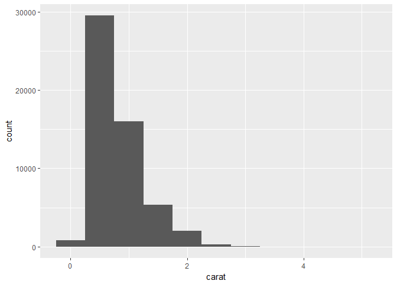<!-- -->

Compute:  

```r
diamonds %>% 
  count(cut_width(carat, 0.5))
```

```
## # A tibble: 11 × 2
##    `cut_width(carat, 0.5)`     n
##                     <fctr> <int>
## 1             [-0.25,0.25]   785
## 2              (0.25,0.75] 29498
## 3              (0.75,1.25] 15977
## 4              (1.25,1.75]  5313
## 5              (1.75,2.25]  2002
## 6              (2.25,2.75]   322
## 7              (2.75,3.25]    32
## 8              (3.25,3.75]     5
## 9              (3.75,4.25]     4
## 10             (4.25,4.75]     1
## 11             (4.75,5.25]     1
```

Can set the width of the intervals with `binwidth` which is measured in units of the `x` variable:  

```r
smaller <- diamonds %>% 
  filter(carat < 3)
  
ggplot(data = smaller, mapping = aes(x = carat)) +
  geom_histogram(binwidth = 0.1)
```

<!-- -->

TO overlay multiple histograms use `geom_freqpoly()`:  

```r
ggplot(data = smaller, mapping = aes(x = carat, colour = cut)) +
  geom_freqpoly(binwidth = 0.1)
```

<!-- -->
Now that data has been visualised, ask follow up questions like "what do you want to learn more about?" or "how could the data be misleading?".  

### 7.3.2 Typical Values
Useful questions:  
* Which values are most common?  
* Which values are rare? Does that match your expectations?  
* Can you see any unusual patterns?  

Example:  

```r
ggplot(data = smaller, mapping = aes(x = carat)) +
  geom_histogram(binwidth = 0.01)
```

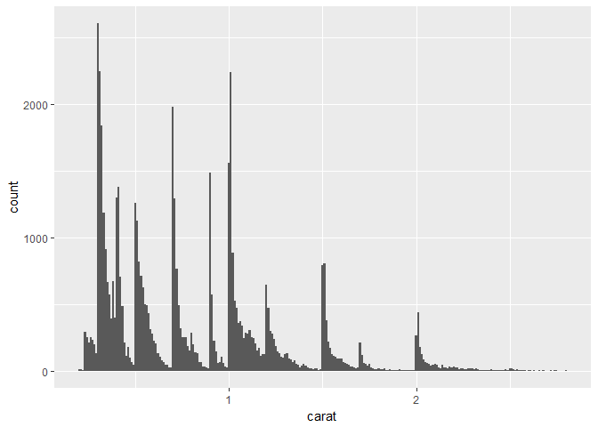<!-- -->

This plot leads to the questions:  
* Why are there more diamonds at whole carats and common fractions of carats?  
* Why are there more diamonds slightly to the right of each peak than there are slightly to the left?  
* Why are there no diamonds bigger than 3 carats?  

Clusters of similiar values suggest subgroups in data. Exploratory questions include:  
* How are the observations within each cluster similar to each other? How are they different?  
* How can you explain or describe the clusters?  
* Why might the appearance of clusters be misleading?  

Cluster example using Old Faithful:  

```r
ggplot(data = faithful, mapping = aes(x = eruptions)) + 
  geom_histogram(binwidth = 0.25)
```

<!-- -->

Clusters seem to be focused on short eruptions of about 2 minutes and long eruptions about 4-5 minutes.  

### 7.3.3 Unusual Values

OUtliers!  
Hard to see in a histogram:  

```r
ggplot(diamonds) + 
  geom_histogram(mapping = aes(x = y), binwidth = 0.5)
```

<!-- -->

Only evidence is the unusually wide limits on the x-axis. So many observations in the common bins that the rare bins are so short you can't see them. Zoom in with `coord_cartesian()`:  

```r
ggplot(diamonds) + 
  geom_histogram(mapping = aes(x = y), binwidth = 0.5) +
  coord_cartesian(ylim = c(0, 50))
```

<!-- -->

`coord_cartesian()` also has `xlim()` for when you need to zoom in on the x-axis. Shows three unusual values. Select them:  

```r
unusual <- diamonds %>% 
  filter(y < 3 | y > 20) %>% 
  select(price, x, y, z) %>%
  arrange(y)
unusual
```

```
## # A tibble: 9 × 4
##   price     x     y     z
##   <int> <dbl> <dbl> <dbl>
## 1  5139  0.00   0.0  0.00
## 2  6381  0.00   0.0  0.00
## 3 12800  0.00   0.0  0.00
## 4 15686  0.00   0.0  0.00
## 5 18034  0.00   0.0  0.00
## 6  2130  0.00   0.0  0.00
## 7  2130  0.00   0.0  0.00
## 8  2075  5.15  31.8  5.12
## 9 12210  8.09  58.9  8.06
```

Good practice to repeat analysis with and without outliers. If the outliers have minimal effect, they can be dropped. If they have a substantial effect, don't drop them without justification (ie figure out why they are there & disclose that in the write-up).

### 7.3.4 Exercises

**1. Explore the distribution of each of the x, y, and z variables in `diamonds`. What do you learn? Think about a diamond and how you might decide which dimension is the length, width, and depth.**  

```r
ggplot(data = diamonds) +
  geom_histogram(mapping = aes(x = x), binwidth = 0.5)
```

<!-- -->

```r
ggplot(data = diamonds) +
  geom_histogram(mapping = aes(x = y), binwidth = 0.5)
```

<!-- -->

```r
ggplot(data = diamonds) +
  geom_histogram(mapping = aes(x = z), binwidth = 0.5)
```

<!-- -->

```r
#Altogether
ggplot(data = diamonds) +
  geom_freqpoly(mapping = aes(x=x, colour = "x"), binwidth = 0.1) + 
  geom_freqpoly(mapping = aes(x=y, colour = "y"), binwidth = 0.1) + 
  geom_freqpoly(mapping = aes(x=z, colour = "z"), binwidth = 0.1)
```

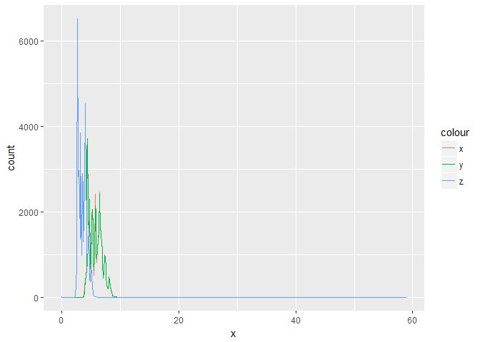<!-- -->

_Well there are definitely outliers in `y`. I think `x` is the depth, `y` is the length, and `z` is the width._

**2. Explore the distribution of `price`. Do you discover anything unusual or surprising? (Hint: Carefully think about the `binwidth` and make sure you try a wide range of values.)**  

```r
ggplot(diamonds, mapping = aes(x = price)) +
  geom_histogram(binwidth = 500)
```

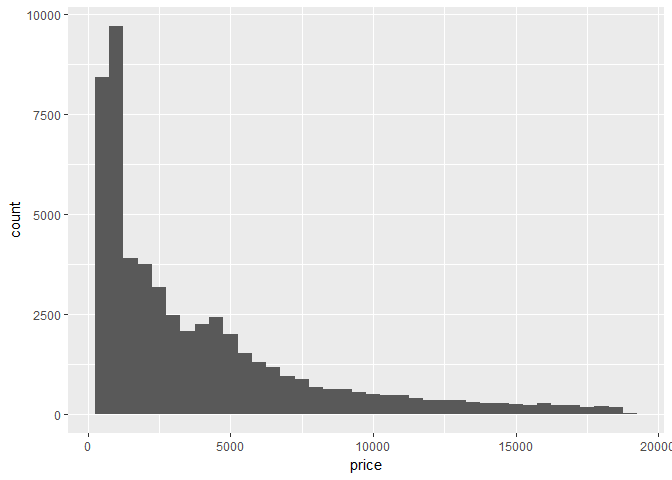<!-- -->

```r
ggplot(diamonds, mapping = aes(x = price)) +
  geom_histogram(binwidth = 1000)
```

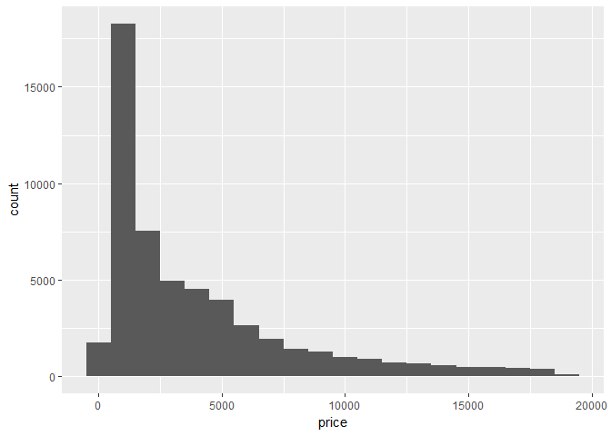<!-- -->

```r
ggplot(diamonds, mapping = aes(x = price)) +
  geom_histogram(binwidth = 5000)
```

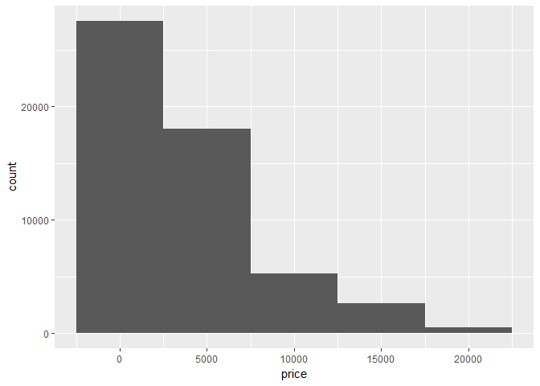<!-- -->


_There are 30 bins, which I found when I graphed the distribution without designating a bin width. If the bin width is set to less than 1, as it has in previous examples, R takes forever to come up with a graph. I think this is because it's trying to subdivide the price by those increments. So if I instead set the bin width to be 1,000 or 5,000 I get a graph much more quickly that drastically reduces the number of bins to be calculated in increments of $1,000 or $5,000._

**3. How many diamonds are 0.99 carat? How many are 1 carat? What do you think is the cause of the difference?**  

```r
carat_sizes <- diamonds %>% 
  filter(carat == 0.99) %>% 
  select(carat, price) %>%
  arrange(price)
carat_sizes
```

```
## # A tibble: 23 × 2
##    carat price
##    <dbl> <int>
## 1   0.99  1789
## 2   0.99  1901
## 3   0.99  2811
## 4   0.99  2812
## 5   0.99  2949
## 6   0.99  3337
## 7   0.99  3593
## 8   0.99  4002
## 9   0.99  4052
## 10  0.99  4075
## # ... with 13 more rows
```

```r
nrow(carat_sizes)
```

```
## [1] 23
```

```r
carat_sizes2 <- diamonds %>% 
  filter(carat == 1) %>% 
  select(carat, price) %>%
  arrange(price)
carat_sizes2
```

```
## # A tibble: 1,558 × 2
##    carat price
##    <dbl> <int>
## 1      1  1681
## 2      1  1784
## 3      1  1805
## 4      1  1932
## 5      1  1954
## 6      1  1997
## 7      1  2035
## 8      1  2058
## 9      1  2098
## 10     1  2112
## # ... with 1,548 more rows
```

```r
nrow(carat_sizes2)
```

```
## [1] 1558
```

_There are 23 diamonds with a carat size of 0.99 and 1,558 diamonds with a carat size of 1. I think the presence of 0.99 carat diamonds is not necessarily because there was demand for that size but more due to error during cutting to 1 carat since 0.99 is an unusual size. I strongly believe this is the case because the pricing is similar between these two carat sizes._

**4. Compare and contrast `coord_cartesian()` vs `xlim()` or `ylim()` when zooming in on a histogram. What happens if you leave `binwidth` unset? What happens if you try and zoom so only half a bar shows?**  

```r
#With coord_cartesian
ggplot(diamonds) + 
  geom_histogram(mapping = aes(x = y), binwidth = 0.5) +
  coord_cartesian(ylim = c(0, 50))
```

<!-- -->

```r
ggplot(diamonds) + 
  geom_histogram(mapping = aes(x = y)) +
  coord_cartesian(ylim = c(0, 50))
```

```
## `stat_bin()` using `bins = 30`. Pick better value with `binwidth`.
```

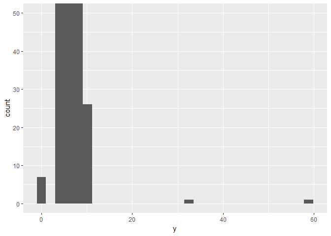<!-- -->

```r
#With xlim or ylim
ggplot(diamonds) + 
  geom_histogram(mapping = aes(x = y), binwidth = 0.5) + 
  ylim(0,50)
```

```
## Warning: Removed 11 rows containing missing values (geom_bar).
```

<!-- -->

```r
ggplot(diamonds) + 
  geom_histogram(mapping = aes(x = y), binwidth = 0.5) + 
  xlim(0,10)
```

```
## Warning: Removed 5 rows containing non-finite values (stat_bin).
```

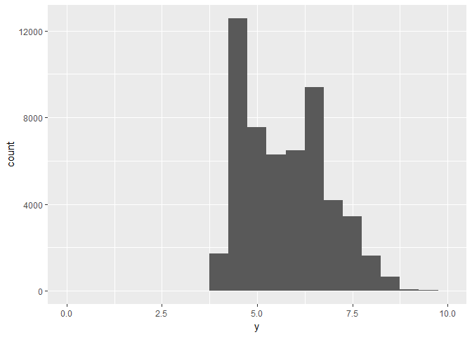<!-- -->

```r
#Can I get a half a bar?
ggplot(diamonds) + 
  geom_histogram(mapping = aes(x = y), binwidth = 0.5) + 
  xlim(5,5.25)
```

```
## Warning: Removed 49646 rows containing non-finite values (stat_bin).
```

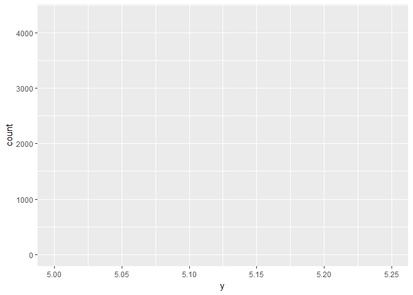<!-- -->

```r
ggplot(diamonds) + 
  geom_histogram(mapping = aes(x = y), binwidth = 0.5) +
  coord_cartesian(ylim = c(0, 4000), xlim = c(0, 10))
```

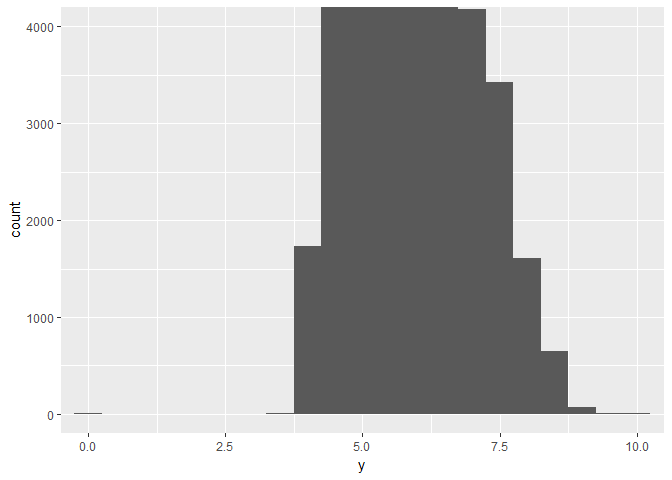<!-- -->

```r
#Use coord_cartesian to zoom in to half a bin on the x-axis. generally use coord_cartesian anyways
```

_Since I know `y` has outliers, I will use that for exploring these. If bin width is left unspecified, R will let you know how many bins it made based on the values present. In this case it made 30 and wants better bins specified. `ylim()` limits the y values, so in this case I effectively filtered out anything with more than 50 obervations as well as rows that were missing data. With `xlim()` I can effectively filter out the outliers past 10. to try to get half a bar to show, I know that if I limit the y-axis with_ `coord_cartesian` _then I can zoom-in and see that the bars seem to extend above the graph. If I limit the x-axis with `xlim()` by attempting to zoom in to half a bin width that I set, this gives me a blank graph because `binwidth` is still trying to subgroup the data within the x limits given. I'm not sure how to zoom in to half a bar along the x-axis._

## 7.4 Missing Values  

Two options to get rid of unusual values:  
1. Drop entire row with strange values. BUT just because one measurement is invalid doesn't mean the rest are.  

```r
diamonds2 <- diamonds %>% 
  filter(between(y, 3, 20))
```

2. Replace unusual values with missing values. Easiesy way shown below with `mutate()` to replace the variable with `ifelse()` to help replace all unusual values (useful if there is a large chunk together like here).  

```r
diamonds2 <- diamonds %>% 
  mutate(y = ifelse(y < 3 | y > 20, NA, y))
```

`ifelse()` has three arguments. `test` should be logical - ie `TRUE` or `FALSE`. The second argument `yes` is what happens when the `test` is `TRUE` and the third argument `no` is what happens when `test` is `FALSE`. `ggplot` then automatically removes missing values when plotting and gives a warning that it did so:  

```r
ggplot(data = diamonds2, mapping = aes(x = x, y = y)) + 
  geom_point()
```

```
## Warning: Removed 9 rows containing missing values (geom_point).
```

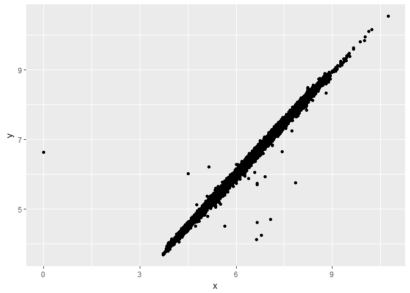<!-- -->

Can supress the warning too:

```r
ggplot(data = diamonds2, mapping = aes(x = x, y = y)) + 
  geom_point(na.rm = TRUE)
```

<!-- -->

Sometimes though you want to compare observations with missing values to observations with recorded values, such as cancelled vs non-cancelled flights:  

```r
nycflights13::flights %>% 
  mutate(
    cancelled = is.na(dep_time),
    sched_hour = sched_dep_time %/% 100,
    sched_min = sched_dep_time %% 100,
    sched_dep_time = sched_hour + sched_min / 60
  ) %>% 
  ggplot(mapping = aes(sched_dep_time)) + 
    geom_freqpoly(mapping = aes(colour = cancelled), binwidth = 1/4)
```

<!-- -->

Can improve this plot later. Needs improvement because # non-cancelled >>> # cancelled.  

### 7.4.1 Exercises

**1. What happens to missing values in a historgram? What happens to missing values in a bar chart? Why is there a difference?**  
_Missing values in a histogram are automatically excluded and a warning is provided saying so. Missing values in a bar chart are also excluded._  

```r
ggplot(data = diamonds2, mapping = aes(x = y)) + 
  labs(title = "Histogram") + 
  geom_histogram(binwidth = 0.5)
```

```
## Warning: Removed 9 rows containing non-finite values (stat_bin).
```

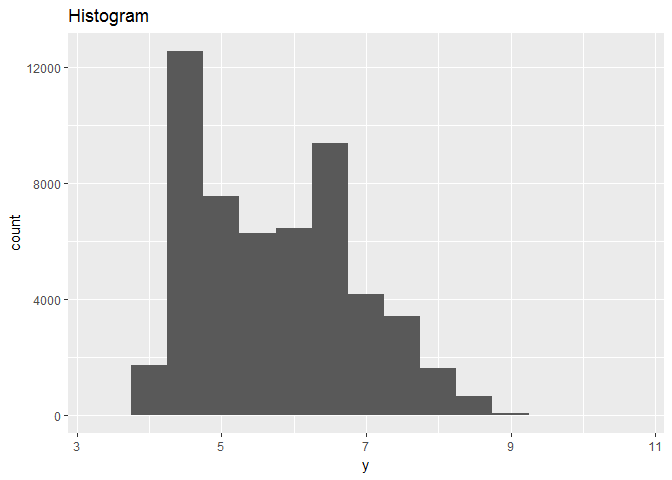<!-- -->

```r
ggplot(data = diamonds2, mapping = aes(x = y)) + 
  labs(title = "Bar Chart") + 
  geom_bar(binwidth = 0.5)
```

```
## Warning: `geom_bar()` no longer has a `binwidth` parameter. Please use
## `geom_histogram()` instead.

## Warning: Removed 9 rows containing non-finite values (stat_bin).
```

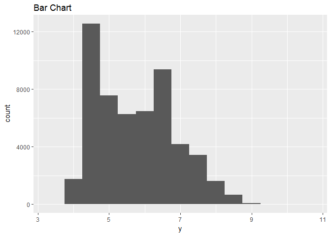<!-- -->


**2. What does `na.rm = TRUE` do in `mean()` and `sum()`?**  
_`na.rm = TRUE` usually silences the warning that missing values were excluded. Let's explore this in `mean()` and `sum()`:_  

```r
x <- c(2,245,1356,1939,NA,NA,NA,234567,1,1234,0686,NA)
#Mean
mean(x)
```

```
## [1] NA
```

```r
#Sum
sum(x)
```

```
## [1] NA
```

```r
#Mean ignoring missing values
mean(x, na.rm = TRUE)
```

```
## [1] 30003.75
```

```r
#Sum ignoring missing values
sum(x, na.rm = TRUE)
```

```
## [1] 240030
```

_The default in `sum()` and `mean()` is to include all numbers in the dataset and if there are missing values, it will just return `NA`. Therefore for these functions, `na.rm = TRUE` tells the functions to ignore missing values when analyzing the data._  

## 7.5 Covariation  

covariation = tendency for values of two or more variables to var together in a related way  

### 7.5.1 A categorical and continuous variable  

Explore distribution of a continous variable broken down by a categorical variable. Default of `geom_freqpoly()` is not useful for this because height is given by count:  

```r
ggplot(data = diamonds, mapping = aes(x = price)) + 
  geom_freqpoly(mapping = aes(colour = cut), binwidth = 500)
```

<!-- -->

Hard to tell the difference because the overall counts differ so much:  

```r
ggplot(diamonds) + 
  geom_bar(mapping = aes(x = cut))
```

<!-- -->

Need to display density on y-axis instead of count! This standardizes the count so the area under the line is equal to 1:  

```r
ggplot(data = diamonds, mapping = aes(x = price, y = ..density..)) + 
  geom_freqpoly(mapping = aes(colour = cut), binwidth = 500)
```

<!-- -->

Can also view this type of covariation with boxplots. Boxplots consist of:  
* a box from the 25th percentile to 75th percentile (IQR) with a line in the middle (median; 50th percentile). This gives an idea of the spread.  
* visual points that show observations that fall more than 1.5xIGQ from either edge of the box (outliers).  
* lines extending from the end of the box to the farthest non-outlier point.  


```r
ggplot(data = diamonds, mapping = aes(x = cut, y = price)) +
  geom_boxplot()
```

<!-- -->

Less information about the distribution but easier to compare.  

`cut` is an ordered factor: fair < good < very good < premium < ideal. Most categorical variables don't have this kind of intrinsic order, so you can reorder them to get more information:  

```r
ggplot(data = mpg, mapping = aes(x = class, y = hwy)) +
  geom_boxplot()
```

<!-- -->

Versus:  

```r
ggplot(data = mpg) +
  geom_boxplot(mapping = aes(x = reorder(class, hwy, FUN = median), y = hwy))
```

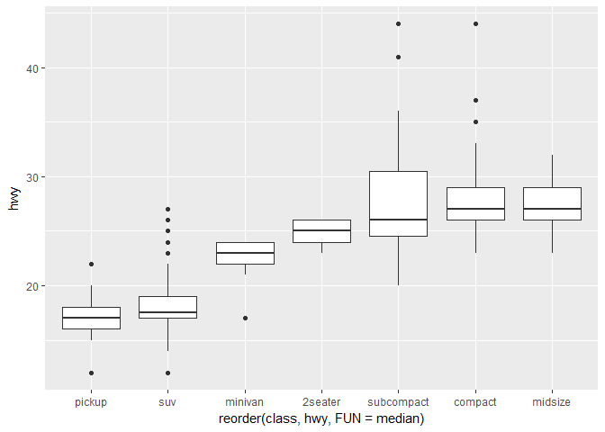<!-- -->

With long variable names, flip the graph:  

```r
ggplot(data = mpg) +
  geom_boxplot(mapping = aes(x = reorder(class, hwy, FUN = median), y = hwy)) +
  coord_flip()
```

<!-- -->


#### 7.5.1.1 Exercises
**1. Use what you’ve learned to improve the visualisation of the departure times of cancelled vs. non-cancelled flights.**  

```r
nycflights13::flights %>% 
  mutate(
    cancelled = is.na(dep_time),
    sched_hour = sched_dep_time %/% 100,
    sched_min = sched_dep_time %% 100,
    sched_dep_time = sched_hour + sched_min / 60
  ) %>% 
  ggplot(mapping = aes(x=cancelled, y=sched_dep_time)) + 
    geom_boxplot()
```

<!-- -->


**2. What variable in the diamonds dataset is most important for predicting the price of a diamond? How is that variable correlated with cut? Why does the combination of those two relationships lead to lower quality diamonds being more expensive?**  

```r
ggplot(diamonds, mapping = aes(x = carat, fill = cut)) + 
  geom_histogram(position = position_dodge() ,binwidth = 0.5)
```

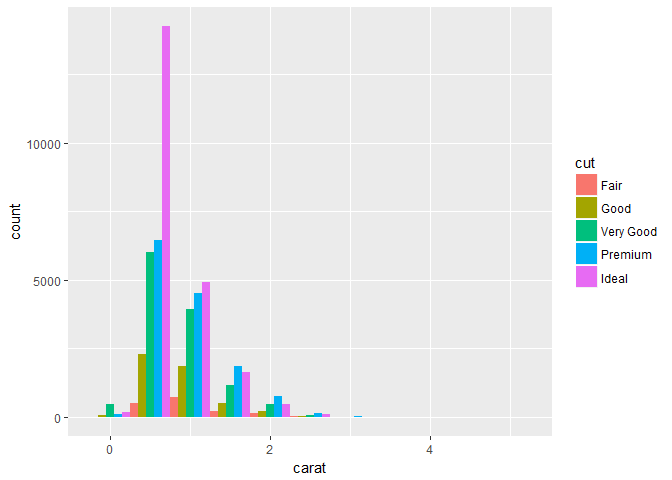<!-- -->

```r
ggplot(diamonds, mapping = aes(price, fill = cut)) + 
  geom_histogram(position = position_dodge(), binwidth = 2000)
```

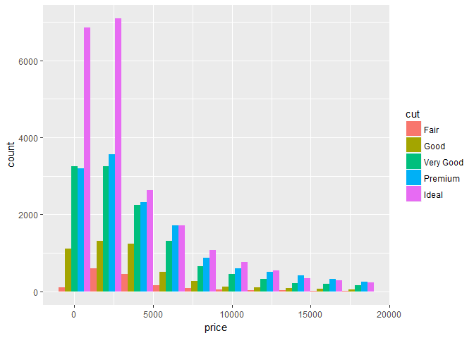<!-- -->

_On average, th diamonds with a lower cut are 1 carat. Not sure how to compare cut, carat, and price altogether Can plot just points._ 

```r
ggplot(diamonds, aes(carat, price)) + 
  geom_point(aes(color = cut))
```

<!-- -->


**3. Install the ggstance package, and create a horizontal boxplot. How does this compare to using `coord_flip()`?**  

```r
library(ggstance)
```

```
## 
## Attaching package: 'ggstance'
```

```
## The following objects are masked from 'package:ggplot2':
## 
##     geom_errorbarh, GeomErrorbarh
```

```r
#coord_flip()
ggplot(data = mpg) +
  geom_boxplot(mapping = aes(x = class, y = hwy)) +
  coord_flip()
```

<!-- -->

```r
#geom_boxploth()
ggplot(data = mpg, mapping = aes(x = hwy, y = class)) +
  geom_boxploth()
```

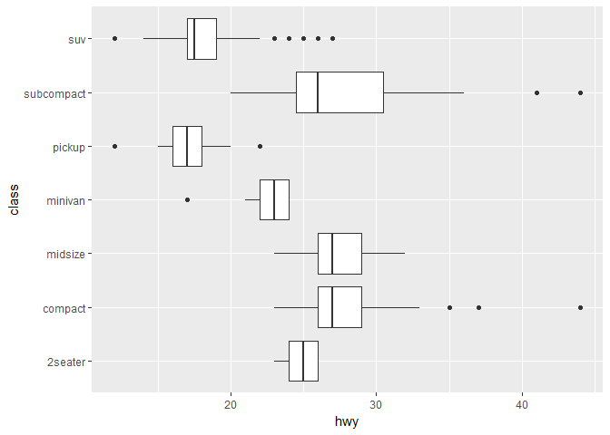<!-- -->

_To get a horizontal boxplot with `ggstance` functions, you need to manually switch the x and y axes in the mapping aesthetic whereas you 'can't' do this with the normal `ggplot` functions and have to use_ `coord_flip()`.

**4. One problem with boxplots is that they were developed in an era of much smaller datasets and tend to display a prohibitively large number of “outlying values”. One approach to remedy this problem is the letter value plot. Install the lvplot package, and try using `geom_lv()` to display the distribution of price vs cut. What do you learn? How do you interpret the plots?**  

```r
library(lvplot)

ggplot(diamonds, mapping = aes(cut, price)) + 
  geom_lv(aes(fill = ..LV..))
```

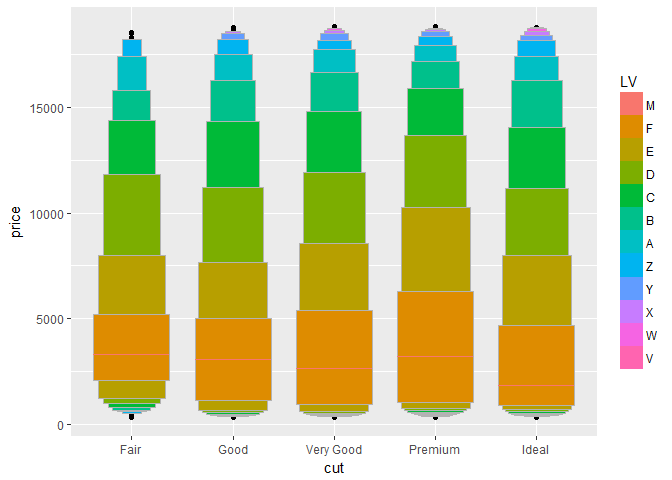<!-- -->

_The plot looks like a tree instead of a box... Also the interquartile markers are missing which is unfortunate if the interest is to compare based on them. These are supposed to be useful for huge datasets (n>200) but I'm not sure how to interpret these._

**5. Compare and contrast `geom_violin()` with a facetted `geom_histogram()`, or a coloured `geom_freqpoly()`. What are the pros and cons of each method?**  

```r
ggplot(diamonds, aes(carat, price, fill = cut)) + 
  labs(title = "Violin Chart") + 
  geom_violin()
```

```
## Warning: position_dodge requires non-overlapping x intervals
```

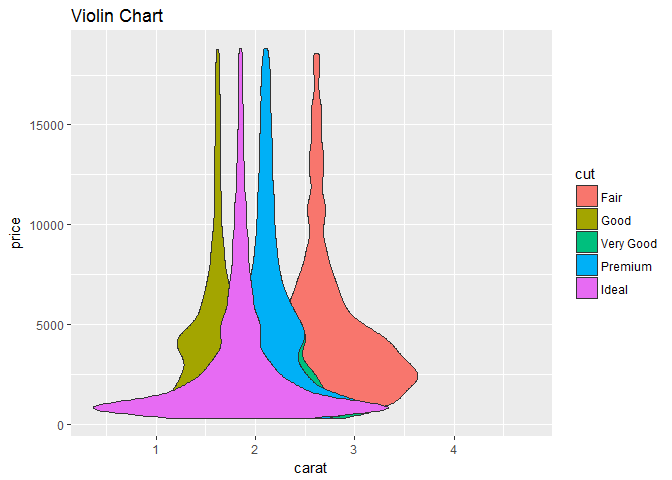<!-- -->

```r
ggplot(diamonds, aes(price)) + 
  labs(title = "Histograms") + 
  facet_wrap(~cut) + 
  geom_histogram(binwidth = 5000)
```

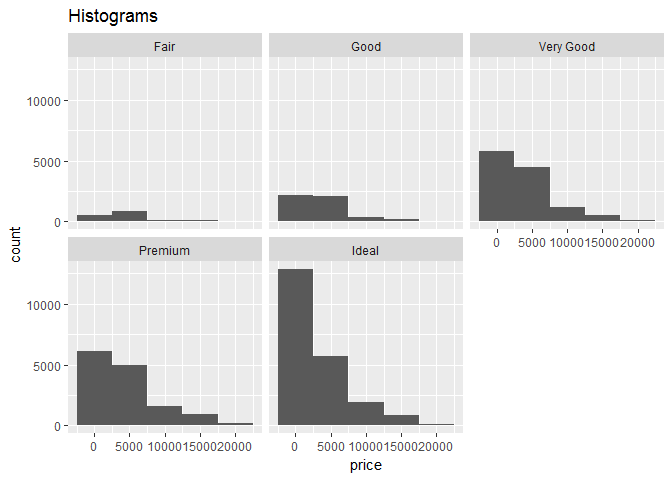<!-- -->

```r
ggplot(diamonds, aes(price, colour = cut)) + 
  labs(title = "Frequency Plot") + 
  geom_freqpoly()
```

```
## `stat_bin()` using `bins = 30`. Pick better value with `binwidth`.
```

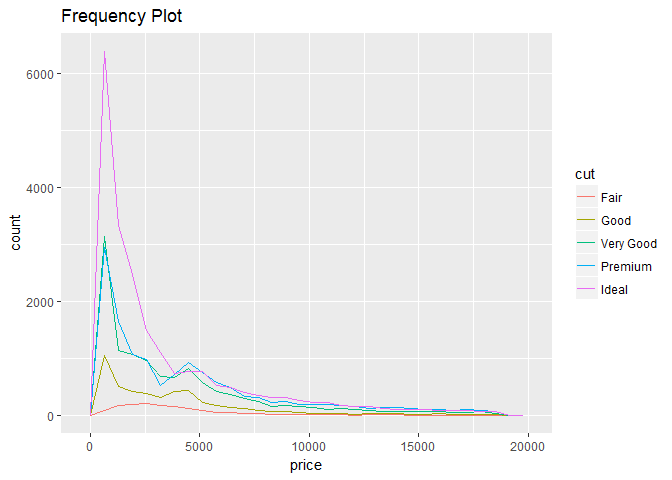<!-- -->

_Violin plots give a lot more flexibility to graph continuous vs continous and color based on categorical variables whereas in histograms and frequency plots, you are limited in the fact the y-axis is always for counts._

**6. If you have a small dataset, it’s sometimes useful to use `geom_jitter()` to see the relationship between a continuous and categorical variable. The ggbeeswarm package provides a number of methods similar to `geom_jitter()`. List them and briefly describe what each one does.**  
* ggbeeswarm: _extends ggplot2 with violin point/beeswarm plots._  
* position_quasirandom: _violin point-style plots to show overlapping points. x must be discrete._  
* geom_beeswarm: _Points, jittered to reduce overplotting using the beeswarm package._  
* position_beeswarm: _Violin point-style plots to show overlapping points. x must be discrete._  
* geom_quasirandom: _Points, jittered to reduce overplotting using the vipor package._  

### 7.5.2 Two categorical variables  

Visualizing the covariation between categorical variables requires counting the number of observations for each combination with `geom_count()`:  

```r
ggplot(data = diamonds) +
  geom_count(mapping = aes(x = cut, y = color))
```

<!-- -->

Where the size of each circle in the plot displays how many observations occurred at each combination of values. Covariation will appear as a strong correlation between specific x and y values. Another approach with `dplyr`:

```r
diamonds %>% 
  count(color, cut)
```

```
## Source: local data frame [35 x 3]
## Groups: color [?]
## 
##    color       cut     n
##    <ord>     <ord> <int>
## 1      D      Fair   163
## 2      D      Good   662
## 3      D Very Good  1513
## 4      D   Premium  1603
## 5      D     Ideal  2834
## 6      E      Fair   224
## 7      E      Good   933
## 8      E Very Good  2400
## 9      E   Premium  2337
## 10     E     Ideal  3903
## # ... with 25 more rows
```

Visualize:

```r
diamonds %>% 
  count(color, cut) %>%  
  ggplot(mapping = aes(x = color, y = cut)) +
    geom_tile(mapping = aes(fill = n))
```

<!-- -->

If they are unordered need to use seriation package to reorder rows and columns to reveal patterns. For larger plots use `d3heatmap` or `heatmaply` packages for interactive plots.  

#### 7.5.2.1 Exercises

**1. How could you rescale the count dataset above to more clearly show the distribution of cut within colour, or colour within cut?**  

```r
diamonds %>% 
  count(color, cut) %>%  
  ggplot(mapping = aes(x = color, y = cut)) +
    geom_tile(aes(fill = n))
```

<!-- -->

```r
diamonds %>% 
  count(color, cut) %>%  
  ggplot(mapping = aes(x = cut, y = color)) +
    geom_tile(aes(fill = n))
```

<!-- -->

```r
#For rescaling:
diamonds %>% 
  count(color, cut) %>% 
  mutate(prop = n/sum(n)) %>% 
  ggplot(mapping = aes(x = color, y = cut)) +
  geom_tile(mapping = aes(fill = prop)) +
  scale_fill_distiller(limits = c(0,1))
```

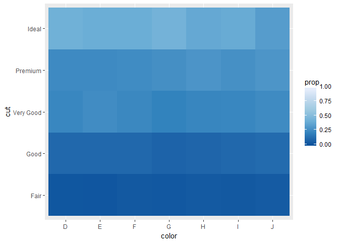<!-- -->


**2. Use `geom_tile()` together with `dplyr` to explore how average flight delays vary by destination and month of year. What makes the plot difficult to read? How could you improve it?**  

```r
flights %>% 
  group_by(month, dest) %>% 
  summarize(mean_delay = mean(arr_delay, na.rm = TRUE)) %>% 
  ggplot(mapping = aes(x = factor(month), y = dest)) +
  geom_tile(aes(fill = mean_delay))
```

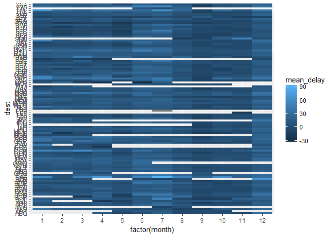<!-- -->


**3. Why is it slightly better to use `aes(x = color, y = cut)` rather than `aes(x = cut, y = color)` in the example above?**  
_Color vs Cut is more intuitive to interpret._

### 7.5.3 Two continuous variables  

Can make scatterplots more useful for large datasets with the `alpha` aesthetic to add transparency:  

```r
ggplot(data = diamonds) + 
  geom_point(mapping = aes(x = carat, y = price), alpha = 1 / 100)
```

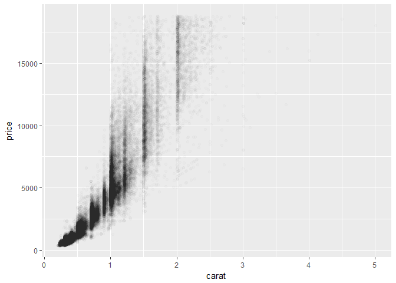<!-- -->

Can also use `geom_bin2d()` and `geom_hex()` to bin in two dimensions:  

```r
library(hexbin)
ggplot(data = smaller) +
  geom_bin2d(mapping = aes(x = carat, y = price))
```

<!-- -->

```r
ggplot(data = smaller) +
  geom_hex(mapping = aes(x = carat, y = price))
```

<!-- -->

These function divide the coordinate plane into 2D bins and use a fill color to show how many points go into each bin. The difference is rectangular vs hexagonal bin shapes. Can also bin one continuous variable like it is a categorical variable:  

```r
ggplot(data = smaller, mapping = aes(x = carat, y = price)) + 
  geom_boxplot(mapping = aes(group = cut_width(carat, 0.1)))
```

<!-- -->

`cut_width()` divides `x` into bins of width `width` and can make width of boxplot proportional to number of points with `varwidth = TRUE`. Can also use `cut_number()` to display the same number of points per bin:  

```r
ggplot(data = smaller, mapping = aes(x = carat, y = price)) + 
  geom_boxplot(mapping = aes(group = cut_number(carat, 20)))
```

<!-- -->


#### 7.5.3.1 Exercises

**1. Instead of summarising the conditional distribution with a boxplot, you could use a frequency polygon. What do you need to consider when using `cut_width()` vs `cut_number()`? How does that impact a visualisation of the 2d distribution of carat and price?**  
_With these two functions applied to carat and price, the measurement of the bins is going to be different because the values contained in carat and price are different.You would need to consider the distribution of your data points when deciding whether or not to use the_ `cut_number`, _or_ `cut_width`. _The cut number gives a better idea, visually, of the distribution of your points._  

**2. Visualise the distribution of carat, partitioned by price.**  

```r
ggplot(diamonds, aes(carat, price)) + 
  geom_boxplot(aes(group = cut_width(price, 1000)))
```

```
## Warning: position_dodge requires non-overlapping x intervals
```

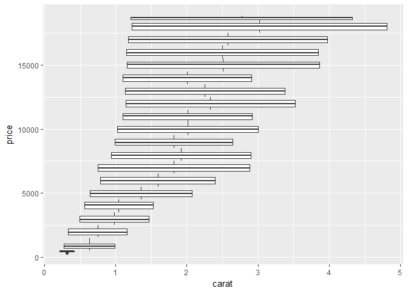<!-- -->

**3. How does the price distribution of very large diamonds compare to small diamonds. Is it as you expect, or does it surprise you?**  
_It is surprising that relatively "small" diamonds of 1 carat or less are just as expensive as the larger diamonds._

**4. Combine two of the techniques you’ve learned to visualise the combined distribution of cut, carat, and price.**

```r
#One example
ggplot(diamonds, aes(x = carat, y = price)) +
  geom_boxplot(aes(fill = cut, cut_width(carat, 1)))
```

<!-- -->

**5. Two dimensional plots reveal outliers that are not visible in one dimensional plots. For example, some points in the plot below have an unusual combination of x and y values, which makes the points outliers even though their x and y values appear normal when examined separately.**

```r
ggplot(data = diamonds) +
  geom_point(mapping = aes(x = x, y = y)) +
  coord_cartesian(xlim = c(4, 11), ylim = c(4, 11))
```

<!-- -->

**Why is a scatterplot a better display than a binned plot for this case?**  
_Binning can potentionally lose your outliers unintentially. Therefore it's easier to detect outliers in a scatterplot. There is a possibility of some detection with a boxplot._  

```r
ggplot(data = diamonds, mapping = aes(x = x, y = y)) +
  geom_boxplot(mapping = aes(group = cut_width(x, .5))) +
  coord_cartesian(xlim = c(4, 11), ylim = c(4, 11))
```

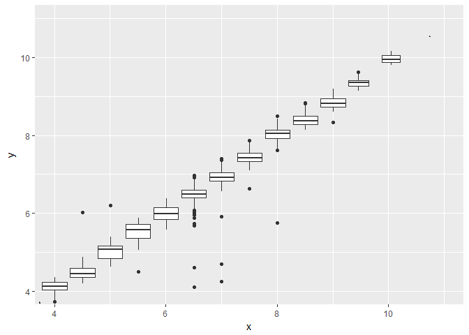<!-- -->

