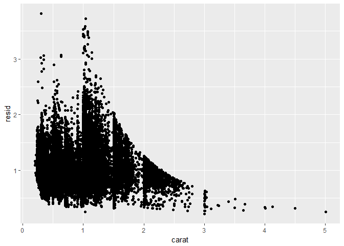
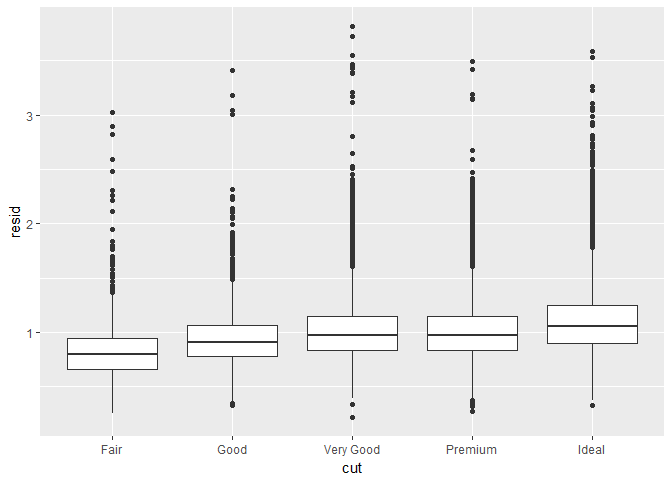
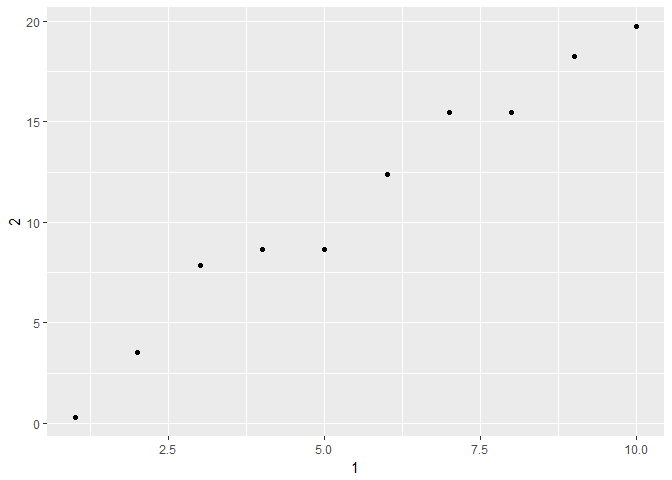

# Through Tibbles


# Exploratory Data Analysis Continued

## 7.6 Patterns and models  

Ask questions about patterns:  
* could this be due to random chance?  
* how can you describe the relationship imlied by the pattern?  
* how strong is that relationship?  
* what other variables affect the relationship?  
* does the relationship change if you look at individual subgroups?  

Patterns reveal covariation. If two variables covary, you can use the values of one variable to make better predictions about the values of the second. If the covariation is due to a causal relationship, you can use the value of one variable to control the value of the second. Use models to extract such patterns out of the data.  
For example, the model below predicts `price` from `carat` and then computes the residuals (difference between predicted value and actual value).  

```r
library(modelr)

mod <- lm(log(price) ~ log(carat), data = diamonds)

diamonds2 <- diamonds %>% 
  add_residuals(mod) %>% 
  mutate(resid = exp(resid))

ggplot(data = diamonds2) + 
  geom_point(mapping = aes(x = carat, y = resid))
```

<!-- -->

```r
ggplot(data = diamonds2) + 
  geom_boxplot(mapping = aes(x = cut, y = resid))
```

<!-- -->


Relative to their size, better quality diamonds are more expensive. This becomes apparent only after removing the strong relationship between cut and price.  

## 7.8 Learning more  

There is a whole book on ggplot2 including some dplyr and tidyr. There is also the R Graphics Cookbook and Graphical Data Analysis with R.  

# Chapter 8  
# Workflow: projects  

1. What about your analysis is "real", ie what will you save as your lasting record of what happened?  
2. Where does your analysis "live"?  

## 8.1 What is real?  

R scripts are "real", not the environment or the objects listed in the environment pane. With the R scripts, you recreate the environment. It's harder to create the scripts from the environment! It is useful to instruct RStudio not to save the workspace between sessions either through settings or just selecting that option each time when quitting. Some shortcut keystrokes:  
1. Ctrl + Shift + F10 to restart RStudio  
2. Ctrl + Shift + S to rerun current script  

## 8.2 Where does your analysis live?  

It lives in the working directory! It is at the top of the console or through the command `getwd()`. Should organize analytical projects into directories and when working on a project, set the working directory to the associated directory.  

## 8.3 Paths and directories  

There are two path styles: Mac/Linux and Windows. There are three ways in which they differ:  
1. how you separate the components of the path. Mac and Linux uses slashes (`plots/diamonds.pdf`) and Windows uses backslashes (`plots\diamonds.pdf`). Because `\` is a special symbol in R, use `\\` for paths. Or just use Mac/Linux path styles.  
2. Absolute paths in Windows start with a drive letter (`C:`) or two backslashes (`\\servername`) whereas Mac/Linux starts with a slash (`/users/hadley`). **NEVER** use absolute paths in your scripts because they hinder sharing - no one else will have exactly the same directory configuration as you.  
3. `~` points to different places. It is a convenient shortcut to the home directory. In Windows, there is no home directory so it points to your documents directory.  

## RStudio projects  

Double-click `.Rproj` files to re-open projects. It will take you back to where you left off with the same working directory and command history and the files being worked on are still open. 

# Chapter 10  
# Tibbles  
## 10.1 Introduction  

Tibbles _are_ data frames but they tweak some older behaviors to make it easier to work with.  

## 10.2 Creating tibbles  

Might want to coerce a data fram to a tibble:  

```r
as_tibble(iris)
```

```
## # A tibble: 150 × 5
##    Sepal.Length Sepal.Width Petal.Length Petal.Width Species
##           <dbl>       <dbl>        <dbl>       <dbl>  <fctr>
## 1           5.1         3.5          1.4         0.2  setosa
## 2           4.9         3.0          1.4         0.2  setosa
## 3           4.7         3.2          1.3         0.2  setosa
## 4           4.6         3.1          1.5         0.2  setosa
## 5           5.0         3.6          1.4         0.2  setosa
## 6           5.4         3.9          1.7         0.4  setosa
## 7           4.6         3.4          1.4         0.3  setosa
## 8           5.0         3.4          1.5         0.2  setosa
## 9           4.4         2.9          1.4         0.2  setosa
## 10          4.9         3.1          1.5         0.1  setosa
## # ... with 140 more rows
```

Can create a new tibble from individual vectors with `tibble()`. It will automatically recycle inputs of length 1 and allows you to refer to variables just created.  

```r
tibble(
  x = 1:5, 
  y = 1, 
  z = x ^ 2 + y
)
```

```
## # A tibble: 5 × 3
##       x     y     z
##   <int> <dbl> <dbl>
## 1     1     1     2
## 2     2     1     5
## 3     3     1    10
## 4     4     1    17
## 5     5     1    26
```

`tibble()` never changes the type of inputs, neer changes the names of variables, and never creates row names. Can have non-syntactic column names. To refer to these, need to surround them with backticks:  

```r
tb <- tibble(
  `:)` = "smile", 
  ` ` = "space",
  `2000` = "number"
)
tb
```

```
## # A tibble: 1 × 3
##    `:)`   ` ` `2000`
##   <chr> <chr>  <chr>
## 1 smile space number
```

Also use backticks when working with these variables in other packages.  

Can also make transposed tibbles with `tribble()`. It is customized for data entry: column headings are defined by formulas and entries are separated by commas:  

```r
tribble(
  ~x, ~y, ~z,
  #--|--|----
  "a", 2, 3.6,
  "b", 1, 8.5
)
```

```
## # A tibble: 2 × 3
##       x     y     z
##   <chr> <dbl> <dbl>
## 1     a     2   3.6
## 2     b     1   8.5
```

Adding a comment helps make it really clear where the header is (`#--|--|----`).  

## 10.3 Tibbles vs data.frame  
### 10.3.1 Printing  

Tibbles have a refined print method that shows only the first 10 rows and all columns that fit on the screen. Each column also reports its type.  

```r
tibble(
  a = lubridate::now() + runif(1e3) * 86400,
  b = lubridate::today() + runif(1e3) * 30,
  c = 1:1e3,
  d = runif(1e3),
  e = sample(letters, 1e3, replace = TRUE)
)
```

```
## # A tibble: 1,000 × 5
##                      a          b     c         d     e
##                 <dttm>     <date> <int>     <dbl> <chr>
## 1  2017-05-31 07:01:12 2017-06-08     1 0.1533283     e
## 2  2017-05-31 01:35:15 2017-06-01     2 0.7288776     r
## 3  2017-05-30 15:46:33 2017-06-14     3 0.1109609     b
## 4  2017-05-31 01:58:37 2017-06-22     4 0.8660077     k
## 5  2017-05-30 13:43:43 2017-06-12     5 0.2295415     z
## 6  2017-05-31 04:35:15 2017-06-15     6 0.6718576     c
## 7  2017-05-31 07:11:14 2017-06-10     7 0.8948506     h
## 8  2017-05-31 10:41:50 2017-06-11     8 0.2458218     u
## 9  2017-05-30 15:07:44 2017-06-13     9 0.9230723     g
## 10 2017-05-30 20:41:01 2017-06-10    10 0.9399503     u
## # ... with 990 more rows
```

They are designed so you don't accidentally overwhelm your console when you print large data frames. There are options if you need more output than the default display:  

```r
nycflights13::flights %>% 
  print(n = 10, width = Inf)
```

```
## # A tibble: 336,776 × 19
##     year month   day dep_time sched_dep_time dep_delay arr_time
##    <int> <int> <int>    <int>          <int>     <dbl>    <int>
## 1   2013     1     1      517            515         2      830
## 2   2013     1     1      533            529         4      850
## 3   2013     1     1      542            540         2      923
## 4   2013     1     1      544            545        -1     1004
## 5   2013     1     1      554            600        -6      812
## 6   2013     1     1      554            558        -4      740
## 7   2013     1     1      555            600        -5      913
## 8   2013     1     1      557            600        -3      709
## 9   2013     1     1      557            600        -3      838
## 10  2013     1     1      558            600        -2      753
##    sched_arr_time arr_delay carrier flight tailnum origin  dest air_time
##             <int>     <dbl>   <chr>  <int>   <chr>  <chr> <chr>    <dbl>
## 1             819        11      UA   1545  N14228    EWR   IAH      227
## 2             830        20      UA   1714  N24211    LGA   IAH      227
## 3             850        33      AA   1141  N619AA    JFK   MIA      160
## 4            1022       -18      B6    725  N804JB    JFK   BQN      183
## 5             837       -25      DL    461  N668DN    LGA   ATL      116
## 6             728        12      UA   1696  N39463    EWR   ORD      150
## 7             854        19      B6    507  N516JB    EWR   FLL      158
## 8             723       -14      EV   5708  N829AS    LGA   IAD       53
## 9             846        -8      B6     79  N593JB    JFK   MCO      140
## 10            745         8      AA    301  N3ALAA    LGA   ORD      138
##    distance  hour minute           time_hour
##       <dbl> <dbl>  <dbl>              <dttm>
## 1      1400     5     15 2013-01-01 05:00:00
## 2      1416     5     29 2013-01-01 05:00:00
## 3      1089     5     40 2013-01-01 05:00:00
## 4      1576     5     45 2013-01-01 05:00:00
## 5       762     6      0 2013-01-01 06:00:00
## 6       719     5     58 2013-01-01 05:00:00
## 7      1065     6      0 2013-01-01 06:00:00
## 8       229     6      0 2013-01-01 06:00:00
## 9       944     6      0 2013-01-01 06:00:00
## 10      733     6      0 2013-01-01 06:00:00
## # ... with 3.368e+05 more rows
```

Can also set options:  
* `options(tibble.print_max = n, tibble.print_min = m)` = if more than m rows, only print n of them. Or use `options(dplyr.print_min = Inf)` to always shows all rows.  
* Use `options(tibble.width = Inf)` to always print all columns  

Can also use built-in data viewer to get a scrollable view of complete dataset in a separate window:  

```r
nycflights13::flights %>% 
  View()
```
### 10.3.2 Subseting  

`[[`can extract by name or position; `$` only extracts by name.  

```r
df <- tibble(
  x = runif(5),
  y = rnorm(5)
)

# Extract by name
df$x
```

```
## [1] 0.5062328 0.7406370 0.2778292 0.5900902 0.8751278
```

```r
# Extract by position
df[[1]]
```

```
## [1] 0.5062328 0.7406370 0.2778292 0.5900902 0.8751278
```

If used in a pipe, use `.` as a special placeholder:  

```r
df %>% .$x
```

```
## [1] 0.5062328 0.7406370 0.2778292 0.5900902 0.8751278
```

```r
df %>% .[["x"]]
```

```
## [1] 0.5062328 0.7406370 0.2778292 0.5900902 0.8751278
```

Tibbles are more strict than data frames; they never do partial matching and will generate a warning if the column you are trying to access doesn't exist.  

## 10.4 Interacting with older code  

Some older functions don't work with tibbles. Can turn tibbles back into data frames for these:  

```r
class(as.data.frame(tb))
```

```
## [1] "data.frame"
```

Main reason is the `[` function. `dplyr::filter()` and `dplyr::select()` allow you to solve the same problems with clearer code. With data frames, `[` sometimes returns a data frame and sometimes a vector but always returns a another tibble when used with a tibble.  

## 10.5 Exercises  

**1. How can you tell if an object is a tibble? (Hint: try printing `mtcars`, which is a regular data frame).**  
_An object is a tibble if when printed includes the value types in the under the column names. Data frames when printed do not do this and this for me is the easiest way to identify a tibble vs a data frame. Additionally tibbles usually have "A tibble" with the dimensions of the tibble at the top of the output._

**2. Compare and contrast the following operations on a data.frame and equivalent tibble. What is different? Why might the default data frame behaviours cause you frustration?**  

```r
df <- data.frame(abc = 1, xyz = "a")
df$x
```

```
## [1] a
## Levels: a
```

```r
df[, "xyz"]
```

```
## [1] a
## Levels: a
```

```r
df[, c("abc", "xyz")]
```

```
##   abc xyz
## 1   1   a
```

```r
dft <- as.tibble(df)
#dft$x
dft[, "xyz"]
```

```
## # A tibble: 1 × 1
##      xyz
##   <fctr>
## 1      a
```

```r
dft[, c("abc", "xyz")]
```

```
## # A tibble: 1 × 2
##     abc    xyz
##   <dbl> <fctr>
## 1     1      a
```
_The first command `df$x` in the data frame returns the value of `xyz` because data frame subsetting allows for partial matching. In the tibble `dft`, the command returns an error: `Unknown or uninitialized column: 'x'.NULL`. The next command for the data frame `df[, "xyz"]` returns just the value again but the tibble command actually returns a 1x1 tibble. Finally, the last command for both data frame and tibble return the same thing, a 2x1 table with the columns characterized as `dbl` and `fctr`._  

**3. If you have the name of a variable stored in an object, e.g. `var <- "mpg"`, how can you extract the reference variable from a tibble?**  
_Extract the mpg info from the tibble and store it in var._

```r
var <- mtcars$mpg
var
```

```
##  [1] 21.0 21.0 22.8 21.4 18.7 18.1 14.3 24.4 22.8 19.2 17.8 16.4 17.3 15.2
## [15] 10.4 10.4 14.7 32.4 30.4 33.9 21.5 15.5 15.2 13.3 19.2 27.3 26.0 30.4
## [29] 15.8 19.7 15.0 21.4
```


**4. Practice referring to non-syntactic names in the following data frame by:**  

```r
annoying <- tibble(
  `1` = 1:10,
  `2` = `1` * 2 + rnorm(length(`1`))
)
```

* **Extracting the variable called `1`.**

```r
annoying$`1`
```

```
##  [1]  1  2  3  4  5  6  7  8  9 10
```


* **Plotting a scatterplot of `1` vs `2`.**

```r
ggplot(annoying, aes(`1`, `2`)) +
  geom_point()
```

<!-- -->


* **Creating a new column called `3` which is `2` divided by `1`.**  

```r
annoying %>% mutate(`3` = `2`/`1`)
```

```
## # A tibble: 10 × 3
##      `1`        `2`       `3`
##    <int>      <dbl>     <dbl>
## 1      1  0.3046535 0.3046535
## 2      2  3.5231164 1.7615582
## 3      3  7.8394379 2.6131460
## 4      4  8.6598255 2.1649564
## 5      5  8.6723865 1.7344773
## 6      6 12.3653865 2.0608978
## 7      7 15.4509417 2.2072774
## 8      8 15.4547517 1.9318440
## 9      9 18.2594444 2.0288272
## 10    10 19.7226935 1.9722693
```


* **Renaming the columns to `one`, `two` and `three`.**  

```r
annoying %>% mutate(`3` = `2`/`1`) %>% select("one" = `1`, "two"=`2`, "three"=`3`)
```

```
## # A tibble: 10 × 3
##      one        two     three
##    <int>      <dbl>     <dbl>
## 1      1  0.3046535 0.3046535
## 2      2  3.5231164 1.7615582
## 3      3  7.8394379 2.6131460
## 4      4  8.6598255 2.1649564
## 5      5  8.6723865 1.7344773
## 6      6 12.3653865 2.0608978
## 7      7 15.4509417 2.2072774
## 8      8 15.4547517 1.9318440
## 9      9 18.2594444 2.0288272
## 10    10 19.7226935 1.9722693
```


**5. What does `tibble::enframe()` do? When might you use it?**  
_`tibble::enframe()` converts atomic vectors to data frames and vice versa. The format is `enframe(x, name = "name", value = "value")` where `name` stores the column names, `value` stores the values, and `x` is an atomic vector for `enframe` or a data frame for `deframe()`. Especially in the second example below it looks like this function rearranges the table such that the columns `a` and `b` became rows._  

```r
enframe(1:3)
```

```
## # A tibble: 3 × 2
##    name value
##   <int> <int>
## 1     1     1
## 2     2     2
## 3     3     3
```

```r
enframe(c(a = 5, b = 7))
```

```
## # A tibble: 2 × 2
##    name value
##   <chr> <dbl>
## 1     a     5
## 2     b     7
```


**6. What option controls how many additional column names are printed at the footer of a tibble?** 
`tibble.max_extra_cols` _controls the number of of extra columns printed in reduced form. The default is 100._
